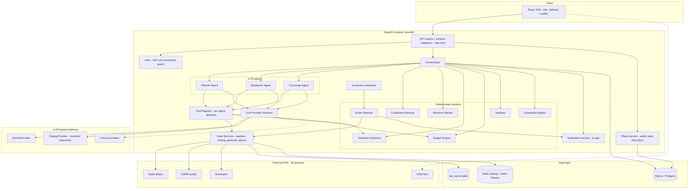
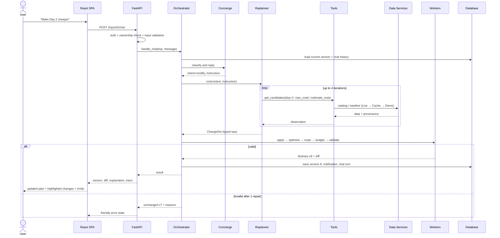
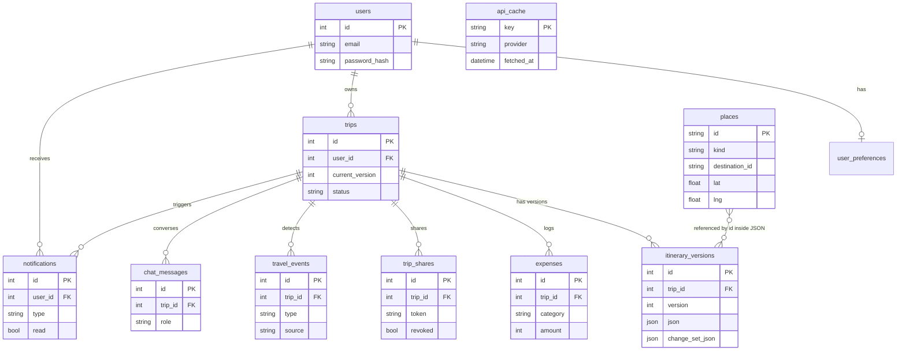
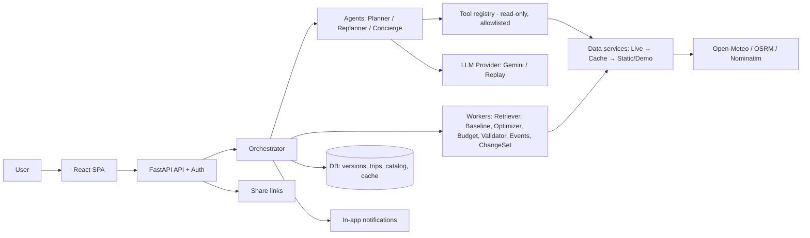

# AI Dynamic Travel Planning Agent: Architecture (v1.0)

Architecture only. No application code, no files, no installs in this phase.\
Audience: a human lead plus AI coding agents (Claude Code) who will implement it in about 10 hours.

---

## 0. Verified facts and design decisions that drive everything

I checked the external services the brief names. Several facts change the design:

| Service                 | What I verified (Oct 2026)                                                                                                                                                                                                                                                                                                                                                                     | Design consequence                                                                                                                                                                                                       |
| ----------------------- | ---------------------------------------------------------------------------------------------------------------------------------------------------------------------------------------------------------------------------------------------------------------------------------------------------------------------------------------------------------------------------------------------- | ------------------------------------------------------------------------------------------------------------------------------------------------------------------------------------------------------------------------ |
| Gemini API free tier    | Pro models left the free tier in April 2026. Free tier covers Flash / Flash-Lite only. Per-model RPM/RPD are no longer published on the docs page; they appear per project in the AI Studio rate-limit console. Free-tier prompts may be used by Google to improve products. Current free-tier default is reported as a Gemini 3-series Flash model, and 2.5 Flash may be older or deprecated. | Model name is an env var, never hardcoded. Check your real limits in AI Studio on day 0. Budget LLM calls tightly (see 3.6). Never send personal data in prompts. A cached/replay LLM mode is mandatory for demo safety. |
| OSRM public demo server | Non-commercial, "reasonable use", max about 1 request/sec, no uptime guarantee, ODbL + OSRM attribution required, access can be withdrawn anytime. Free-flow durations only (no traffic).                                                                                                                                                                                                      | Throttle to 1 rps, cache every leg by coordinate pair, always have a haversine fallback. Show attribution.                                                                                                               |
| Nominatim               | Max 1 req/sec, descriptive User-Agent mandatory, results should be cached, no bulk use.                                                                                                                                                                                                                                                                                                        | Geocode only at seed time and for rare user input. Cache forever. Seed data already has coordinates.                                                                                                                     |
| Open-Meteo              | Free for non-commercial use, no API key. I did not re-verify the exact daily call cap; treat it as "verify before relying".                                                                                                                                                                                                                                                                    | Cache forecasts 3 hours in DB. Demo fixtures for weather. Few calls anyway (one per trip refresh).                                                                                                                       |
| Free places data        | No reliable free "places with opening hours and prices" API exists for India.                                                                                                                                                                                                                                                                                                                  | **Core decision: a curated seed catalog of places is the source of truth.** The LLM may only choose from catalog IDs. This also kills hallucinated places.                                                               |
| Supabase free tier      | Free projects can pause after inactivity (known behavior; verify current policy).                                                                                                                                                                                                                                                                                                              | Default DB is SQLite for dev/demo, with Postgres as a one-line `DATABASE_URL` swap. No hard dependency on a hosted DB during judging.                                                                                    |

**Eight decisions that shape the whole design**

1. **Grounded generation.** Backend retrieves candidates from the catalog. LLM picks and justifies. Backend does the maths.
2. **Three LLM agents plus deterministic workers.** Not five LLM agents (reasoning in section 3).
3. **One canonical itinerary JSON.** Every agent and worker reads and writes it. Changes happen only via typed **ChangeSet** operations, never free-form rewrites.
4. **Versioned snapshots.** Every change creates `itinerary_versions` row N+1. Revert means "copy version K to a new version".
5. **A deterministic baseline planner always exists.** If the LLM is down, rate-limited, or returns junk, a rule-based planner still produces a valid itinerary. The LLM *improves* the plan; it is not a single point of failure.
6. **Every data item carries provenance:** `live | cache | static | demo | simulated`. The UI shows it. Nothing demo is passed off as live.
7. **"Real-time" is honest.** Pull-based refresh (on dashboard open, a "Check conditions" button, and a light in-process scheduler). No websockets, no push infrastructure.
8. **Modular monolith.** One FastAPI service, one React SPA, one database.

---

## 1. Executive architecture

```
User
 ↓
Frontend (React SPA)            shows itinerary, map, budget, chat; renders provenance badges
 ↓  HTTPS/JSON
Backend API (FastAPI)           auth, validation, ownership checks, rate limits, error envelope
 ↓
Agent Orchestrator              classifies intent, picks agent/workflow, owns context + versions
 ↓
Agents (Planner, Replanner, Concierge)    LLM reasoning with a constrained tool allowlist each
 ↓
Tools (typed functions)         thin wrappers: some call data services, some are pure code
 ↓
Data services + deterministic workers   provider chain: Live → Cache → Static/Demo
 ↓
Data layer (SQLite/Postgres)    trips, versions, catalog, cache, notifications, expenses
 ↓
Response                        itinerary version + diff + explanation + provenance + agent trace
```

**What each layer is responsible for**

| Layer         | Responsibility                                                                                                  | Must NOT                                                              |
| ------------- | --------------------------------------------------------------------------------------------------------------- | --------------------------------------------------------------------- |
| Frontend      | Collect input, render the canonical itinerary, show provenance and agent trace                                  | Compute budgets or routes                                             |
| API           | Auth, schema validation, ownership, rate limit, uniform errors                                                  | Contain business logic                                                |
| Orchestrator  | Intent routing, context assembly, running the pipeline (apply → optimize → route → budget → validate → version) | Call the LLM for arithmetic                                           |
| Agents        | Reason, choose from candidates, produce ChangeSets, explain                                                     | Write to the DB, call tools outside their allowlist, invent place IDs |
| Tools         | Typed, validated, permission-bounded functions                                                                  | Accept user IDs from the LLM                                          |
| Data services | Fetch with fallback chain and attach provenance                                                                 | Raise raw exceptions upward                                           |
| Workers       | Deterministic optimize/budget/validate/event-detect                                                             | Depend on the LLM                                                     |
| Data layer    | Persist, version, isolate users                                                                                 | Hold derived data that can drift                                      |

---

## 2. High-level system architecture



---

## 3. Agent architecture

### 3.1 Evaluating the suggested five-agent design

| Suggested agent              | Verdict                                                             | Why                                                                                                                                                                                                                                     |
| ---------------------------- | ------------------------------------------------------------------- | --------------------------------------------------------------------------------------------------------------------------------------------------------------------------------------------------------------------------------------- |
| Travel Orchestrator / Master | **Keep as code, not an LLM.**                                       | Intent routing is mostly deterministic (which UI action or endpoint). An LLM is only needed to classify free chat text, and that lives inside the Concierge. A deterministic orchestrator is faster, testable, and does not burn quota. |
| Recommendation Agent         | **Merge into Planner.**                                             | Choosing places *is* planning. A separate agent would pass the same candidate list around for no gain. "Explore" recommendations are served by the deterministic Candidate Retriever plus one optional LLM "why this suits you" call.   |
| Optimization Agent           | **Not an LLM agent.** Becomes the deterministic Schedule Optimizer. | Ordering stops by geography and time windows is an algorithm problem. An LLM would be slower and worse at it.                                                                                                                           |
| Dynamic Replanning Agent     | **Keep as a real agent.**                                           | This is the heart of "agentic": reacts to events, searches alternatives, proposes changes.                                                                                                                                              |
| Conversational Assistant     | **Keep, as the Concierge.**                                         | The conversational front door. It routes modification intents to the Replanner.                                                                                                                                                         |

**Final: 3 LLM agents + 6 deterministic workers.** Same underlying model; different system instructions, tool allowlists, context, output schemas, and validators. The agents are real because each runs a **tool-calling loop** (reason → call tool → observe → decide) and its output is **validated and applied by code**.

### 3.2 How agents communicate

- **No agent-to-agent chat.** Agents never talk to each other.
- The Orchestrator holds an `AgentContext` (typed object) and hands it to one agent at a time:\
  `{ trip_id, user_id (not visible to LLM), itinerary_json, preferences, events[], candidate_pool, constraints, conversation_summary, request }`
- Agents return **structured outputs only**: a `Selection` (Planner), a `ChangeSet` (Replanner), or a `ConciergeReply` (Concierge: text + optional `intent` + optional ChangeSet request).
- Hand-offs go through the Orchestrator:\
  Concierge detects "make Day 2 cheaper" → returns `intent=modify, instruction=...` → Orchestrator invokes Replanner with that instruction.
- Max **4 tool-loop iterations** per agent call. After that the agent must emit its final JSON.

### 3.3 Planner Agent

| Field              | Detail                                                                                                                                                                                                                    |
| ------------------ | ------------------------------------------------------------------------------------------------------------------------------------------------------------------------------------------------------------------------- |
| Purpose            | Create the initial personalized itinerary and alternative variants                                                                                                                                                        |
| Responsibilities   | Pick hotel, choose activities per day with themes, pick meals, write a short *reason* for every item, flag trade-offs                                                                                                     |
| Inputs             | Preferences, trip params, candidate pool (about 25 attractions, 12 restaurants, 6 hotels, pre-scored), weather summary                                                                                                    |
| Outputs            | `Selection` JSON: hotel_id, per-day theme, ordered activity_ids, meal ids, `reason` + `reason_factors` per item, and 2 alternative themes                                                                                 |
| Tools              | `get_candidates` (re-query with different filters), `get_weather`, `get_place_details`, `estimate_costs` (quick budget probe)                                                                                             |
| Data it can access | Catalog (read), weather (read). Nothing user-identifying.                                                                                                                                                                 |
| Invoked when       | Trip generation, "regenerate trip", "give me alternatives"                                                                                                                                                                |
| Decisions          | Which places, which day, which hotel, how to trade off interests vs budget vs pace                                                                                                                                        |
| Must NOT           | Invent place IDs, state any cost or distance as fact (backend computes), schedule times (the optimizer does), exceed the daily activity cap for the chosen pace                                                           |
| Failure behavior   | Retry once with the validator's error list. Then fall back to the **Baseline Planner**, which creates a valid plan with rule-based scoring. UI shows "Plan built with rules-based fallback (AI temporarily unavailable)". |
| Example            | "4 days in Goa, ₹30,000, 2 people, beaches + food + heritage, relaxed"                                                                                                                                                    |

### 3.4 Replanning Agent

| Field            | Detail                                                                                                                                                                                      |
| ---------------- | ------------------------------------------------------------------------------------------------------------------------------------------------------------------------------------------- |
| Purpose          | Adapt an existing itinerary to events or edits by producing a minimal ChangeSet                                                                                                             |
| Responsibilities | Interpret the trigger (event or instruction), identify affected items, search alternatives, propose the **smallest** set of operations, explain the change                                  |
| Inputs           | Current itinerary JSON, trigger (`WeatherEvent`, `BudgetChange`, or natural-language instruction), locked items, filtered candidate pool                                                    |
| Outputs          | `ChangeSet { ops[], rationale, expected_effects }` (ops vocabulary in section 13)                                                                                                           |
| Tools            | `get_candidates`, `get_weather`, `get_place_details`, `estimate_costs`, `get_day_summary`                                                                                                   |
| Invoked when     | Chat modification intents, weather events, budget/duration/preference changes, availability changes                                                                                         |
| Decisions        | What to remove, replace, move, or add; whether a budget target is achievable                                                                                                                |
| Must NOT         | Touch locked items, rewrite the whole itinerary when a local change suffices, change trip dates or destination without an explicit user instruction, emit ops outside the vocabulary        |
| Failure behavior | Invalid ops are rejected with reasons. One repair retry. Then keep the current version and return a clear message ("I couldn't safely apply that. Here's what I tried."). Never half-apply. |
| Example          | "Make Day 2 cheaper" or `WeatherEvent(day=3, rain_prob=85%)`                                                                                                                                |

### 3.5 Concierge Agent

| Field            | Detail                                                                                                                                                                                            |
| ---------------- | ------------------------------------------------------------------------------------------------------------------------------------------------------------------------------------------------- |
| Purpose          | Conversational interface: answer questions, explain recommendations, detect modification intent                                                                                                   |
| Responsibilities | Explain why items were chosen (using stored `reason_factors`, not invention), answer trip questions from the itinerary JSON, classify intent, ask a clarifying question only when truly ambiguous |
| Inputs           | Message, last 10 chat turns (or summary), itinerary JSON (read-only), provenance info                                                                                                             |
| Outputs          | `ConciergeReply { text, intent: answer or modify or regenerate or clarify, instruction? }`                                                                                                        |
| Tools            | `get_day_summary`, `get_place_details`, `get_weather`, `explain_item`                                                                                                                             |
| Invoked when     | Any chat message                                                                                                                                                                                  |
| Decisions        | Is this a question or a change request?                                                                                                                                                           |
| Must NOT         | Modify the itinerary itself, quote prices not in the JSON, answer from outside the trip context as if it were fact                                                                                |
| Failure behavior | Return a canned helpful message and keep chat history. Itinerary is unaffected.                                                                                                                   |
| Example          | "Why did you put Fort Aguada on Day 1?"                                                                                                                                                           |

### 3.6 LLM call budget (free-tier discipline)

| Action               | Max LLM calls                                                                                     |
| -------------------- | ------------------------------------------------------------------------------------------------- |
| Generate trip        | 2 to 3 (tool turns + final selection)                                                             |
| Alternatives         | 0 extra (Planner returns 2 alternative themes in the same call; backend materializes them lazily) |
| Chat question        | 1                                                                                                 |
| Chat modification    | 2 (Concierge intent + Replanner)                                                                  |
| Weather replan       | 1 to 2                                                                                            |
| Explore "why" blurbs | 0 (use stored `reason_factors`); optional 1                                                       |

A response cache (hash of prompt + model) sits in front of the provider, which also powers demo replay (section 24).

### 3.7 Deterministic workers (not agents)

| Worker              | Job                                                                                          |
| ------------------- | -------------------------------------------------------------------------------------------- |
| Candidate Retriever | Filter and score catalog places by destination, interests, budget level, accessibility, pace |
| Baseline Planner    | Greedy rule-based itinerary builder (fallback when LLM fails, also the test oracle)          |
| Schedule Optimizer  | Cluster activities to days, order stops, assign time windows                                 |
| Budget Engine       | All money maths                                                                              |
| Validator           | Hard rules on any itinerary                                                                  |
| Event Detector      | Turns weather/budget conditions into typed events with affected item IDs                     |
| ChangeSet Applier   | Validates and applies ops to a copy of the itinerary                                         |

---

## 4. Master orchestrator

The Orchestrator is plain Python (a small state machine), not an LLM.

**Entry points and routing**

| Entry                                                       | How it routes                                                                                    |
| ----------------------------------------------------------- | ------------------------------------------------------------------------------------------------ |
| `POST /trips/{id}/generate`                                 | Direct to the *Generate workflow*                                                                |
| `POST /trips/{id}/chat`                                     | Concierge classifies intent. `modify` goes to the *Modify workflow*. `answer` returns the reply. |
| `POST /trips/{id}/events/check` or scheduler tick           | Event Detector. If events exist, the *Replan workflow*.                                          |
| `PATCH /trips/{id}/preferences` or `/budget` or `/duration` | Direct to the *Replan workflow* with a structured trigger (no chat intent needed)                |
| `POST /trips/{id}/versions/{v}/revert`                      | Direct, no LLM                                                                                   |

Routing is deterministic wherever the UI already told us the intent. Only free-text chat needs an LLM to classify, which keeps quota usage low.

**The shared pipeline (every workflow ends here)**

```
ChangeSet or Selection
 → Apply (ChangeSet Applier, on a copy)
 → Optimize (affected days only)
 → Route (legs; OSRM → cache → haversine)
 → Budget (Budget Engine)
 → Validate (hard rules)
 → [errors? → one repair loop to the agent] → [still failing? → reject, keep current version]
 → Persist as version N+1 + diff + notification
 → Response
```

**Context maintenance:** The trip's current itinerary comes from the DB each request (stateless server). Chat history is stored in `chat_messages`. The Concierge gets the last 10 turns. The `AgentContext` is rebuilt per request. No in-memory sessions to lose on restart.

**Final validation:** nothing the LLM says reaches the user as itinerary data unless it passed the Validator. The explanation text is separate and can never change numbers: all numbers in the UI come from the JSON.



---

## 5. Canonical itinerary data model

Rules:

- IDs are stable strings (`day_2`, `it_d2_03`). The LLM refers to items only by ID.
- Money is **integer rupees** (INR). No floats for currency.
- Times are `HH:MM` local. Dates are ISO.
- Every external-derived block has `source` and `as_of`.
- Fields marked (derived) are written only by workers, never by agents.

```json
{
  "schema_version": "1.0",
  "trip_id": "trip_42",
  "version": 7,
  "parent_version": 6,
  "created_by": "replanner_agent",
  "change_summary": "Replaced Day 3 beach with indoor museum due to rain forecast",
  "mode": "live",

  "trip": {
    "title": "Goa Escape",
    "destination": { "name": "Goa", "country": "IN", "lat": 15.4909, "lng": 73.8278, "catalog_id": "dest_goa" },
    "start_date": "2026-11-20",
    "end_date": "2026-11-23",
    "num_days": 4,
    "travelers": { "adults": 2, "children": 0 },
    "currency": "INR"
  },

  "preferences": {
    "interests": ["beaches", "food", "heritage"],
    "pace": "relaxed",
    "budget_level": "mid",
    "transport_modes": ["taxi", "scooter"],
    "accommodation_type": "hotel",
    "dietary": ["no_beef"],
    "avoid": ["nightclubs"],
    "mobility": "standard"
  },

  "budget": {
    "total_limit": 30000,
    "reserve_pct": 10,
    "breakdown": { "accommodation": 9600, "transport": 3100, "food": 6400, "activities": 3500, "misc": 1800, "reserve": 3000 },
    "estimated_total": 24400,
    "spendable": 27000,
    "remaining": 2600,
    "per_day": 6100,
    "per_person": 12200,
    "status": "ok",
    "computed_at": "2026-10-03T10:12:00Z"
  },

  "accommodation": {
    "place_id": "hotel_goa_03",
    "name": "Candolim Courtyard",
    "nights": 3,
    "rooms": 1,
    "nightly_cost": 3200,
    "check_in": "2026-11-20",
    "check_out": "2026-11-23",
    "booking": { "type": "reference", "url": "https://example.com/hotel", "ref": null, "note": "Reference link only. Not a live booking." },
    "reason": "Walkable to beach and cafes; fits mid budget"
  },

  "days": [
    {
      "id": "day_1",
      "day_number": 1,
      "date": "2026-11-20",
      "theme": "Old Goa heritage and sunset",
      "weather": { "summary": "Sunny", "temp_max_c": 32, "rain_prob_pct": 10, "source": "live", "as_of": "2026-10-03T09:00:00Z" },
      "items": [
        {
          "id": "it_d1_01",
          "type": "activity",
          "place_id": "poi_goa_basilica",
          "name": "Basilica of Bom Jesus",
          "category": "heritage",
          "lat": 15.5009, "lng": 73.9116,
          "start_time": "09:30", "end_time": "11:00", "duration_min": 90,
          "indoor": true,
          "cost": { "amount": 0, "per": "person", "basis": "catalog" },
          "reason": "Matches your heritage interest; best visited in morning light",
          "reason_factors": ["interest:heritage", "time_window:morning", "cost:free"],
          "locked": false,
          "status": "planned",
          "booking": null,
          "alt_ids": ["poi_goa_se_cathedral"]
        }
      ],
      "routes": [
        {
          "id": "rt_d1_01",
          "from_item": "it_d1_01", "to_item": "it_d1_02",
          "mode": "taxi",
          "distance_km": 9.4, "duration_min": 24,
          "cost": 380,
          "source": "live",
          "geometry": [[15.5009,73.9116],[15.4989,73.8278]]
        }
      ],
      "totals": { "activity_cost": 900, "food_cost": 1500, "transport_cost": 760, "travel_minutes": 58, "active_minutes": 430 }
    }
  ],

  "alternatives": [
    {
      "id": "alt_1",
      "label": "Cheaper: skip water sports, add Sunburn-free beach day",
      "summary": "Saves about ₹3,200, adds 25 min travel",
      "delta": { "cost": -3200, "travel_min": 25 },
      "change_set": { "ops": [] }
    }
  ],

  "events": [
    { "id": "ev_1", "type": "weather", "day_id": "day_3", "severity": "high", "detail": "Rain 85%", "source": "simulated", "handled_in_version": 7 }
  ],

  "notes": [ { "id": "n1", "day_id": null, "text": "Carry a light rain jacket", "origin": "user" } ],

  "provenance": { "weather": "live", "routing": "cache", "places": "static", "llm": "live", "overall": "live_with_fallbacks" },
  "warnings": [ { "code": "ROUTE_FALLBACK", "message": "2 legs estimated (haversine)", "day_id": "day_2" } ]
}
```

**Allowed item `type` values:** `activity | meal | transit | free_time | checkin | checkout`.\
**Allowed `source` values:** `live | cache | static | demo | simulated | estimated`.\
**Ownership of fields:** Agents may propose changes only to `preferences`, item selection, `reason`, `notes`. Everything else is (derived) and written by workers.

---

## 6. Database architecture

**Principle:** the canonical JSON in `itinerary_versions` is the source of truth for the plan. Separate tables for days, activities, routes, and transportation would duplicate the JSON and create drift. They are intentionally **not** tables. Normalized tables exist only where we query, filter, or write independently.

| Table                | Purpose                                                                 | Key columns                                                                                                                                                                       |
| -------------------- | ----------------------------------------------------------------------- | --------------------------------------------------------------------------------------------------------------------------------------------------------------------------------- |
| `users`              | Accounts                                                                | id, email, password_hash, display_name, created_at                                                                                                                                |
| `user_preferences`   | Default travel profile, reused for new trips                            | user_id, interests[], pace, budget_level, dietary[], home_city                                                                                                                    |
| `trips`              | Trip header and pointer                                                 | id, user_id, title, destination_id, start_date, end_date, status, current_version, mode                                                                                           |
| `itinerary_versions` | **Source of truth.** Full JSON snapshot per version                     | id, trip_id, version, parent_version, json, created_by, change_summary, change_set_json, created_at                                                                               |
| `places`             | Seed catalog (attractions, restaurants, hotels in one table via `kind`) | id, destination_id, kind, name, category, tags[], lat, lng, cost_amount, cost_per, duration_min, open_from, open_to, closed_days[], indoor, rating, description, source, verified |
| `expenses`           | User-logged actual spending                                             | id, trip_id, day_id, category, amount, note, spent_at                                                                                                                             |
| `notifications`      | In-app inbox                                                            | id, user_id, trip_id, type, title, body, severity, read, created_at, due_at                                                                                                       |
| `trip_shares`        | Public read-only links                                                  | id, trip_id, token (random 32 bytes), version_pinned?, expires_at, revoked                                                                                                        |
| `travel_events`      | Detected or simulated events                                            | id, trip_id, type, day_id, severity, payload, source, handled_version, created_at                                                                                                 |
| `api_cache`          | Provider cache                                                          | key, provider, value_json, fetched_at, ttl_seconds                                                                                                                                |
| `chat_messages`      | Assistant conversation                                                  | id, trip_id, role, content, intent, version_before, version_after, created_at                                                                                                     |

11 tables. `SavedItineraries` = `trips` (saved is the default state). `ItineraryVersions` and `TravelEvents` are separate, as the brief suggested. `Routes`, `Transportation`, `TripDays`, `Activities`, `Restaurants`, `Accommodations` are in the JSON (and `places` for catalog entries).



**Relationships in words:** a user owns many trips. A trip has many immutable versions plus one `current_version` pointer. Versions reference catalog places by ID inside the JSON, not by FK. Expenses, events, chats, notifications, and shares hang off the trip. `api_cache` and `places` are global.

**Revert** = create version N+1 as a copy of version K (history is never rewritten).

---

## 7. API architecture

All responses use one envelope:\
`{ "ok": true, "data": {...}, "meta": { "provenance": {...}, "request_id": "..." } }`\
Errors: `{ "ok": false, "error": { "code": "BUDGET_INVALID", "message": "...", "details": {...} } }`.\
All routes except auth, destinations list, and shared-trip view require a JWT. Every `/trips/{id}/...` route does an ownership check.

| Group               | Method | Path                                    | Purpose                                                | Request                                               | Response                                                  |
| ------------------- | ------ | --------------------------------------- | ------------------------------------------------------ | ----------------------------------------------------- | --------------------------------------------------------- |
| **Auth**            | POST   | /auth/register                          | Create account                                         | email, password, display_name                         | user, token                                               |
|                     | POST   | /auth/login                             | Log in                                                 | email, password                                       | token, user                                               |
|                     | POST   | /auth/demo                              | One-click seeded demo user                             | none                                                  | token, user                                               |
| **Users**           | GET    | /users/me                               | Current user                                           | none                                                  | user                                                      |
| **Preferences**     | GET    | /users/me/preferences                   | Get default preferences                                | none                                                  | preferences                                               |
|                     | PUT    | /users/me/preferences                   | Save defaults                                          | preferences                                           | preferences                                               |
| **Trips**           | GET    | /destinations                           | Supported destinations                                 | none                                                  | list (name, blurb, image, coverage)                       |
|                     | POST   | /trips                                  | Create trip (not yet generated)                        | destination_id, dates, travelers, budget, preferences | trip                                                      |
|                     | GET    | /trips                                  | Saved trips                                            | none                                                  | trip summaries                                            |
|                     | GET    | /trips/{id}                             | Trip + current itinerary                               | none                                                  | trip, itinerary                                           |
|                     | DELETE | /trips/{id}                             | Delete                                                 | none                                                  | ok                                                        |
| **Itinerary**       | POST   | /trips/{id}/generate                    | Run Planner workflow                                   | optional: regenerate flag                             | itinerary v1, trace, alternatives                         |
|                     | GET    | /trips/{id}/versions                    | Version history                                        | none                                                  | list (version, summary, by, time)                         |
|                     | GET    | /trips/{id}/versions/{v}                | One version                                            | none                                                  | itinerary                                                 |
|                     | GET    | /trips/{id}/diff?from=a&to=b            | Diff between versions                                  | query                                                 | diff                                                      |
|                     | POST   | /trips/{id}/versions/{v}/revert         | Revert                                                 | none                                                  | new current version                                       |
|                     | PATCH  | /trips/{id}/items/{item_id}             | Manual edits (lock, remove, move)                      | op                                                    | itinerary, diff                                           |
|                     | POST   | /trips/{id}/alternatives/{alt_id}/apply | Apply an alternative                                   | none                                                  | itinerary, diff                                           |
|                     | PATCH  | /trips/{id}/settings                    | Change budget, duration, preferences (triggers replan) | partial settings                                      | itinerary, diff                                           |
| **AI Assistant**    | POST   | /trips/{id}/chat                        | Message in, reply plus optional modification out       | message                                               | reply, intent, version_change?, diff?, trace              |
|                     | GET    | /trips/{id}/chat                        | History                                                | none                                                  | messages                                                  |
| **Recommendations** | GET    | /trips/{id}/recommendations?kind=&day=  | Ranked catalog candidates (with reasons)               | query                                                 | places with scores and reason_factors                     |
| **Routes**          | GET    | /trips/{id}/routes/{day_id}             | Day route legs and geometry                            | none                                                  | routes, provenance                                        |
| **Weather**         | GET    | /trips/{id}/weather                     | Forecast per trip day                                  | none                                                  | per-day weather, provenance                               |
|                     | POST   | /trips/{id}/events/check                | Pull-based condition check, may trigger replan         | none                                                  | events, replan result?                                    |
|                     | POST   | /trips/{id}/events/simulate             | Inject a labeled simulated event (demo)                | type, day_id, severity                                | event, replan result                                      |
| **Expenses**        | GET    | /trips/{id}/budget                      | Estimate vs breakdown                                  | none                                                  | budget block                                              |
|                     | POST   | /trips/{id}/expenses                    | Log actual spend                                       | category, amount, day_id, note                        | expense, totals                                           |
|                     | GET    | /trips/{id}/expenses                    | List with totals                                       | none                                                  | expenses, totals by category                              |
| **Notifications**   | GET    | /notifications                          | Inbox                                                  | query: unread                                         | list                                                      |
|                     | POST   | /notifications/{id}/read                | Mark read                                              | none                                                  | ok                                                        |
| **Sharing**         | POST   | /trips/{id}/share                       | Create public link                                     | optional expiry                                       | token, url                                                |
|                     | DELETE | /trips/{id}/share                       | Revoke                                                 | none                                                  | ok                                                        |
|                     | GET    | /shared/{token}                         | Public read-only itinerary (no auth)                   | none                                                  | sanitized itinerary                                       |
| **Analytics**       | GET    | /trips/{id}/analytics                   | Trip analytics                                         | none                                                  | spend by category, per-day, planned vs actual, time split |
|                     | GET    | /analytics/overview                     | Across trips                                           | none                                                  | totals, trips count                                       |
| **System**          | GET    | /health                                 | Liveness + provider status                             | none                                                  | status per provider, demo mode flag                       |

34 endpoints. `PATCH /items` and `/settings` are the only places that mutate without chat. They go through the same pipeline.

---

## 8. Frontend architecture

React + Vite + Tailwind + react-leaflet. State: **TanStack Query** for server data, one small **Zustand** store for UI state (active day, assistant drawer open, demo banner). No Redux.

**Pages (routes)**

| Page            | Route            | Contents                                                                                                                                               |
| --------------- | ---------------- | ------------------------------------------------------------------------------------------------------------------------------------------------------ |
| Landing         | `/`              | Pitch, "Try demo" button (calls `/auth/demo`), login/register                                                                                          |
| Auth            | `/login`         | Login and register                                                                                                                                     |
| New Trip wizard | `/trips/new`     | 4 steps: Destination → Dates, travelers, budget → Interests, pace, transport, stay → Review and Generate                                               |
| Trip Dashboard  | `/trips/:id`     | Header (title, dates, budget status, provenance badges) + tabs: **Itinerary, Map, Budget, Explore, Versions, Analytics** + persistent Assistant drawer |
| Saved Trips     | `/trips`         | Cards with status, budget, last change                                                                                                                 |
| Notifications   | `/notifications` | Inbox, mark read, link to trip                                                                                                                         |
| Shared Trip     | `/s/:token`      | Public read-only itinerary + map, no auth                                                                                                              |

**Folders and responsibilities**

```
frontend/src/
  pages/        route-level screens; compose features, no logic
  components/   dumb, reusable UI: Button, Card, Badge, Modal, Tabs, Spinner, ErrorState, ProvenanceBadge, DiffChip
  features/     one folder per domain, each with its own components + hooks
    auth/         LoginForm, RegisterForm
    trip-wizard/  Step components, WizardShell, validation
    itinerary/    DayList, DayCard, ItemRow, ReasonPopover, LockToggle, AlternativesPanel
    map/          TripMap, DayRouteLayer, ItemMarker, MapLegend
    budget/       BudgetSummary, BreakdownChart, ExpenseForm, ExpenseList
    explore/      CandidateGrid, PlaceCard, AddToDayButton
    assistant/    AssistantDrawer, MessageList, Composer, AgentTrace, DiffPreview
    versions/     VersionTimeline, DiffView, RevertButton
    notifications/ Bell, NotificationList
    share/        ShareDialog, SharedView
    analytics/    SpendByCategory, PlannedVsActual, DayLoad
  services/     api client (fetch wrapper, envelope unwrap, auth header), one file per backend group
  hooks/        useTrip, useItinerary, useChat, useWeather, useNotifications (TanStack Query wrappers)
  state/        Zustand store (ui.ts)
  utils/        formatCurrency, formatTime, diff helpers, provenance labels, constants
  types/        TypeScript types mirroring backend schemas
```

Rules for the frontend:

- The UI **never calculates** cost, distance, or time. It only displays values from the JSON.
- Every block backed by external data renders a `ProvenanceBadge` (Live, Cached, Demo, Simulated, Estimated).
- A global `DemoBanner` shows when `mode != live`.
- Loading states show the **agent trace** (steps like "Searching candidates…", "Optimizing routes…"). This makes the agentic behavior visible during the demo.
- After any change, show a `DiffChip` summary and an **Undo** button (reverts to the previous version).
- If the map tiles fail, the Map tab shows a day-by-day list of stops with distances (no blank screen).

---

## 9. Backend project structure

```
backend/
  app/
    main.py            app factory, router registration, middleware, startup (seed, scheduler)
    core/
      config.py        env-based settings (pydantic-settings); DEMO_MODE, LLM_PROVIDER, LLM_MODEL
      security.py      password hashing, JWT, ownership guard dependency
      errors.py        AppError types + exception handlers + response envelope
      logging.py       structured logs with request_id, no secrets, no raw prompts
      ratelimit.py     simple in-memory limiter for chat/generate
    api/               thin routers: auth, users, trips, itinerary, chat, recommendations,
                       routes, weather, expenses, notifications, sharing, analytics, health
    schemas/           pydantic models: itinerary (canonical), changeset, selection, requests, responses
    models/            SQLAlchemy ORM tables (section 6)
    repositories/      DB access only: trips, versions, places, expenses, notifications, shares, cache
    orchestrator/
      orchestrator.py  workflows: generate, modify, replan, revert
      pipeline.py      apply → optimize → route → budget → validate → persist
      context.py       AgentContext builder
    agents/
      base.py          tool-calling loop, max iterations, JSON-output enforcement, tracing
      planner.py       prompts + output schema + allowlist
      replanner.py
      concierge.py
      prompts/         system prompt text files (versioned, reviewable)
    llm/
      base.py          LLMProvider interface: generate_json(), generate_with_tools()
      gemini.py        Gemini implementation
      replay.py        ReplayProvider: recorded responses for demo and tests
      cache.py         prompt-hash response cache
    tools/
      registry.py      tool definitions + per-agent allowlists
      (one module per tool group: places, weather, routing, budget, itinerary_read)
    services/          data services with provider chains
      weather.py       Open-Meteo → cache → fixtures
      routing.py       OSRM (throttled) → cache → haversine
      geocoding.py     cache → seed → Nominatim (rare)
      catalog.py       places queries (static catalog)
      provenance.py    Provenance type + helpers
    workers/           deterministic, no LLM
      candidates.py    retrieval and scoring
      baseline.py      rule-based planner
      optimizer.py     clustering + ordering + time windows
      budget.py        Budget Engine
      validator.py     rules
      events.py        Event Detector
      changeset.py     op vocabulary + applier
      diff.py          version diff
    notifications/     create + dedupe notifications, scheduler job
    data/
      seed/            places_*.json per destination, demo user, demo trips
      fixtures/        weather_*.json, routes_*.json, llm_replay/*.json
    tests/
  scripts/
    seed_db.py         load seed
    record_replay.py   record live LLM responses into fixtures (run beforehand)
    verify_seed.py     one-time Nominatim check on coordinates (1 rps)
  .env.example         names only, no values
```

Dependency direction: `api → orchestrator → (agents, workers) → (tools, services, repositories)`. Workers never import agents. Agents never import repositories (they go through tools).

---

## 10. Frontend project structure

See section 8. Additional top-level layout:

```
frontend/
  index.html
  vite.config.ts
  tailwind.config.js
  .env.example         VITE_API_BASE_URL
  src/                 (as in section 8)
  tests/               a few component tests + one Playwright smoke spec
```

Avoid deeper than 3 levels of nesting under `features/`.

---

## 11. AI tool architecture

Tools are typed functions with JSON-schema inputs. Each agent receives only its allowlist. Tool inputs never contain user or trip ownership. Those are bound by the orchestrator in a closure.

| Tool                   | Input                                                                    | Output                                                         | Backing                                      | Planner | Replanner | Concierge |
| ---------------------- | ------------------------------------------------------------------------ | -------------------------------------------------------------- | -------------------------------------------- | ------- | --------- | --------- |
| `get_candidates`       | kind, filters (interests, max_cost, indoor, near item_id, day_id), limit | scored place summaries (id, name, cost, duration, tags, score) | Deterministic (catalog)                      | ✔       | ✔         |           |
| `get_place_details`    | place_id                                                                 | full catalog record                                            | Deterministic                                | ✔       | ✔         | ✔         |
| `get_weather`          | day or date range                                                        | per-day forecast + provenance                                  | **External** (Open-Meteo → cache → fixtures) | ✔       | ✔         | ✔         |
| `estimate_costs`       | draft list of place_ids + days                                           | per-category estimate                                          | Deterministic (Budget Engine)                | ✔       | ✔         |           |
| `get_day_summary`      | day_id                                                                   | compact view: items, times, cost, travel minutes               | Deterministic                                |         | ✔         | ✔         |
| `explain_item`         | item_id                                                                  | stored `reason` + `reason_factors` + alternatives              | Deterministic                                |         |           | ✔         |
| `estimate_travel_time` | place_id A, B, mode                                                      | minutes, km, source                                            | **External** → cache → haversine             | ✔       | ✔         |           |

**Not agent tools (called by the pipeline only):** `optimize_schedule`, `calculate_route`, `calculate_budget`, `validate_itinerary`, `apply_changeset`. The agent cannot skip or bypass validation, and cannot directly write itinerary data.

Search-style tools (`search_places`, `search_restaurants`, `search_accommodation`) are all `get_candidates` with different `kind` values. One tool, not three.

**Boundaries:** read-only tools only. The agent's only "write" is returning a structured output. Everything else is the Orchestrator's job.

---

## 12. Dynamic replanning architecture

Every trigger becomes a typed **Event** or **Instruction**, handled by the same flow.

| Trigger                | Detection                                                            | Affected items                                  | Default response                                                           |
| ---------------------- | -------------------------------------------------------------------- | ----------------------------------------------- | -------------------------------------------------------------------------- |
| Weather (rain, heat)   | Event Detector: rain_prob ≥ 60% or temp_max ≥ 38 °C vs outdoor items | Outdoor items on that day (`indoor=false`)      | Replace with indoor/near alternatives or shift to a better day             |
| Preference change      | `PATCH /settings` diff                                               | Items conflicting with new interests/avoid list | Replace conflicting items                                                  |
| Budget change          | Budget Engine says `status=over` or limit changed                    | Highest-cost, lowest-reason-score items first   | Cheaper substitutions, drop paid extras, cheaper hotel only if needed      |
| Duration change        | `num_days` changed                                                   | Entire day structure                            | Add: new day from candidates. Remove: merge least valuable day into others |
| Activity removed       | User or chat                                                         | That item                                       | Fill the gap only if the day becomes too empty                             |
| Activity added         | User or chat                                                         | Target day                                      | Insert, re-optimize order and time, spill to neighbor day if over capacity |
| Availability changed   | Catalog `closed_days` / simulated closure                            | Item on closed day                              | Move to an open day or replace                                             |
| Transportation changed | Setting change                                                       | All routes                                      | Recompute routes and transport budget; no LLM needed                       |

**Unified flow**

```
Trigger (event / settings change / chat instruction)
 ↓
Event Detector → typed Event (affected_item_ids, severity, source)
 ↓
Orchestrator builds AgentContext (affected items, locked items, filtered candidate pool)
 ↓
Replanner Agent: reads context, calls get_candidates / get_weather / estimate_costs
 ↓
ChangeSet (minimal ops + rationale)
 ↓
ChangeSet Applier (validates ops on a copy)
 ↓
Optimizer (affected days only) → Routes (changed legs only) → Budget → Validator
 ↓
Persist version N+1 (+ change_set_json for audit and diff)
 ↓
Notification created: "Day 3 updated for rain: Palolem Beach → Goa State Museum (saves ₹400)"
 ↓
UI shows diff + Undo (revert to N)
```

**Pure-code shortcuts** (no LLM needed, saves quota and time): transport change, duration shrink with obvious merge, closed-day move. The Orchestrator runs the Baseline Planner's repair logic.

**Example: weather.** Forecast refresh finds Day 3 rain 85%. Event Detector marks `it_d3_01` (beach) and `it_d3_03` (sunset point) as affected. Replanner calls `get_candidates(kind=attraction, indoor=true, near=it_d3_02, max_cost=800)`, proposes `REPLACE_ITEM` ×2 plus `MOVE_ITEM` to swap the beach to Day 4 (forecast sunny). Applier checks locks and IDs. Optimizer re-times Day 3 and 4. Routes recomputed for changed legs only. Budget: -₹250. Validator passes. Version 8 saved. Notification sent.

**Honesty about "real time":** triggers are pull-based. Detection happens when (a) the user opens the dashboard and the forecast cache is older than 3 hours, (b) the user clicks "Check conditions", or (c) the in-process scheduler runs every 60 minutes while the server is up. There is no push from weather providers.

---

## 13. Natural-language modification

**Principle:** language in → *typed operations* out → validated → applied by code. The LLM never edits the itinerary JSON directly.

**ChangeSet operation vocabulary (closed set)**

| Op                          | Fields                        | Meaning                                                    |
| --------------------------- | ----------------------------- | ---------------------------------------------------------- |
| `ADD_ITEM`                  | day_id, place_id, position?   | Insert a catalog place                                     |
| `REMOVE_ITEM`               | item_id                       | Remove                                                     |
| `REPLACE_ITEM`              | item_id, new_place_id         | Swap, keep slot                                            |
| `MOVE_ITEM`                 | item_id, to_day_id, position? | Move across/within days                                    |
| `SET_BUDGET`                | total_limit                   | New budget                                                 |
| `SET_PREFERENCE`            | key, value (from enum)        | pace, interests add/remove, avoid add/remove, budget_level |
| `SET_DURATION`              | num_days                      | Trip length                                                |
| `SET_ACCOMMODATION`         | place_id                      | Change hotel                                               |
| `LOCK_ITEM` / `UNLOCK_ITEM` | item_id                       | Protect from replans                                       |
| `REGENERATE_DAY`            | day_id, constraints           | Rebuild one day from candidates                            |

**How the example commands map**

| Command                        | Interpretation                                                                                           | Ops (typical)                                                                                  |
| ------------------------------ | -------------------------------------------------------------------------------------------------------- | ---------------------------------------------------------------------------------------------- |
| "Make Day 2 cheaper."          | Replanner calls `get_day_summary(day_2)`, finds highest-cost items, `get_candidates(max_cost < current)` | `REPLACE_ITEM` ×1–3                                                                            |
| "Remove museums."              | Deterministic filter first: items with `category=museum`                                                 | `REMOVE_ITEM` per match, optional refill                                                       |
| "Add one beach."               | `get_candidates(category=beach)`, choose best day by geography and capacity                              | `ADD_ITEM`                                                                                     |
| "Reduce travel time."          | Re-cluster by geography                                                                                  | `MOVE_ITEM`/`REGENERATE_DAY`, optimizer weight shifted to travel minutes                       |
| "Change my budget to ₹15,000." | Structured, parsed deterministically from text                                                           | `SET_BUDGET`, then replan if `status=over`                                                     |
| "Replace the restaurant."      | Ambiguous if multiple. Concierge asks which, or replaces the dinner on the current day                   | `REPLACE_ITEM`                                                                                 |
| "Make the trip less tiring."   | Map to pace                                                                                              | `SET_PREFERENCE(pace=relaxed)` + `REMOVE_ITEM` for the lowest-value item on over-capacity days |

**Validation layers (in order)**

1. **Schema:** ops conform to the JSON schema (enums, types). Reject the whole ChangeSet on failure.
2. **Referential:** every `item_id`, `day_id`, `place_id` exists (place in the catalog for this destination).
3. **Policy:** no op touches a `locked` item. Max 8 ops per ChangeSet. No `SET_DURATION`/destination change unless the user instruction mentions it.
4. **Apply to a copy.**
5. **Re-run optimizer, routes, budget.**
6. **Itinerary validation rules** (section 14/19): opening hours, daily time window, activity cap, budget status, no duplicates.
7. **Size-of-change guard:** if the diff changes more than 40% of items for a small instruction, return it as a **preview** that the user must confirm instead of auto-applying.
8. Persist version, show diff + Undo.

**Ambiguity:** if the Concierge sets `intent=clarify`, it asks one short question. Never guesses on destructive changes.

**Infeasible requests** (e.g., "budget ₹5,000" for a 4-day trip): the Budget Engine reports the minimum feasible cost. The agent explains the gap and offers the closest feasible plan as an alternative. The current version stays untouched.

---

## 14. Budget engine

Pure deterministic Python. The LLM never does arithmetic. It may *read* the output and explain it.

**Inputs:** itinerary items (with catalog cost data), travelers, nights, route legs, preferences, `total_limit`, `reserve_pct`, tunables in config.

**Calculations (all integers in ₹, round up to nearest ₹10 per category line)**

| Category               | Formula                                                                                                                                                             |
| ---------------------- | ------------------------------------------------------------------------------------------------------------------------------------------------------------------- |
| Accommodation          | `nightly_rate × nights × rooms`, where `rooms = ceil(adults/2) + ceil(children/4)` (config)                                                                         |
| Activities             | `Σ item.cost` where `per=person` → `amount × travelers`, `per=group` → `amount`                                                                                     |
| Food                   | Per meal item: restaurant `avg_cost_per_person × travelers`. For unplanned meal slots: `meal_default[budget_level] × travelers`                                     |
| Transportation (local) | `Σ leg.distance_km × rate_per_km[mode]` with a per-trip minimum per day. `mode=walk` is 0. Intercity transport is a user-entered optional line (`manual_transport`) |
| Miscellaneous          | `misc_pct (default 8%) × (accommodation + activities + food + transport)`                                                                                           |
| Emergency reserve      | `total_limit × reserve_pct` (default 10%), held back, not spent in the plan                                                                                         |
| **Estimated total**    | `accommodation + activities + food + transport + misc`                                                                                                              |
| Spendable              | `total_limit − reserve`                                                                                                                                             |
| Remaining              | `spendable − estimated_total` (can be negative)                                                                                                                     |
| Per-day                | `estimated_total / num_days`                                                                                                                                        |
| Per-person             | `estimated_total / travelers_total`                                                                                                                                 |
| **Status**             | `ok` if estimated ≤ spendable; `tight` if ≤ total_limit (reserve partly consumed); `over` otherwise                                                                 |

**How the AI interacts:**

- The agent can call `estimate_costs(draft)` as a read-only probe while planning ("will this fit?").
- After the agent proposes anything, the **pipeline** recalculates the true budget. Agent estimates are never stored.
- The Concierge explains budget questions using the stored JSON values.
- Budget warnings are generated by the engine (`status` transitions create notifications).

**Feasibility function:** `min_feasible_cost(preferences, days)` computes the cheapest plausible plan (cheapest hotel tier, free attractions, cheapest meals). Used for infeasible-budget responses and for form validation (frontend shows a hint when budget is below the minimum).

**Tests:** table-driven unit tests for every row above (section 20).

---

## 15. Routing and map architecture

| Concern                 | Choice                                                                                                                                                                                                            |
| ----------------------- | ----------------------------------------------------------------------------------------------------------------------------------------------------------------------------------------------------------------- |
| Map display             | Leaflet (react-leaflet) + OpenStreetMap raster tiles, with attribution shown                                                                                                                                      |
| Geocoding               | **Seed-time only.** Catalog places ship with coordinates, verified once by `verify_seed.py` using Nominatim at 1 rps with a proper User-Agent. Runtime geocoding is rare (custom start point) and cached forever. |
| Route calculation       | OSRM public demo server `route` service, **per leg, per day**, throttled to 1 rps, cached by `(lat1,lng1,lat2,lng2,mode)`. Typical trip: about 20–25 legs, calls are lazy and cached.                             |
| Distance / time         | From OSRM when available (`source=live` or `cache`). Otherwise haversine × 1.3 circuity factor ÷ average speed by mode (`source=estimated`).                                                                      |
| Markers                 | Numbered per day, color per day, popup with name, time, cost, reason                                                                                                                                              |
| Day route visualization | Polyline per day from stored `geometry`; if absent, straight dashed lines between markers (clearly styled as "approximate")                                                                                       |
| Day toggle              | Filter by day, "All days" overview                                                                                                                                                                                |

**Optimizer uses haversine only** (fast, no network) for clustering and ordering. OSRM is only called afterwards for the final legs. This protects the demo from routing outages and rate limits.

**Fallback chain:** OSRM live → `api_cache` (including pre-warmed demo routes) → haversine estimate with `ROUTE_FALLBACK` warning and `estimated` badge. If OSM tiles fail, the Map tab falls back to a stop list with distances.

**Attribution:** "© OpenStreetMap contributors" on the map, plus "Routing by OSRM" on route views.

**Pre-warming:** before judging, run a script that generates the demo trips once so all demo legs sit in `api_cache`.

---

## 16. Real-time / external data architecture

| Requirement                                      | Needs live data?      | Class                                                                            | Notes                                                                               |
| ------------------------------------------------ | --------------------- | -------------------------------------------------------------------------------- | ----------------------------------------------------------------------------------- |
| Place catalog (attractions, restaurants, hotels) | No                    | **STATIC**                                                                       | Curated seed. Honest label: "Catalog data". Prices are typical estimates, not live. |
| Opening hours / closed days                      | No                    | **STATIC**                                                                       | Simplified weekly pattern in the seed                                               |
| Weather forecast                                 | Yes                   | **LIVE** → **CACHED** (3 h TTL) → **DEMO** fixture                               | Open-Meteo                                                                          |
| Weather alerts                                   | Derived from forecast | LIVE/CACHED/**SIMULATED**                                                        | Rules over forecast. A "simulate rain" button creates a *simulated* event           |
| Route distance and duration                      | Nice to have          | **LIVE** → **CACHED** (long TTL) → **ESTIMATED**                                 | OSRM                                                                                |
| Geocoding                                        | Mostly no             | **STATIC** (seed) / **CACHED**                                                   | Nominatim only for new input                                                        |
| Events / festivals                               | Optional              | **STATIC** (small seeded list per destination, labeled "Sample events")          | No reliable free live events API. Do not claim live events.                         |
| Availability                                     | No                    | **STATIC** (closed days) / **SIMULATED**                                         | Real availability needs paid partner APIs                                           |
| Booking info                                     | No                    | **STATIC**                                                                       | Reference links only (see below)                                                    |
| LLM reasoning                                    | Yes                   | **LIVE** → **CACHED** (prompt-hash) → **REPLAY** (recorded) → rules **BASELINE** |                                                                                     |

**Booking/reference integration (deliverable 20):** each hotel and attraction may carry an official-site or search-link reference, an optional `booking.ref` the user can type in ("I booked it, ref ABC123"), and a clear "reference only, not a live booking" note. No payments. No inventory claims.

**Provider-chain contract** (every data service):

```
get(request) →
  try live (timeout 4 s, 1 retry)       → return data + provenance(source=live, fetched_at)
  else try cache (any age)              → return data + provenance(source=cache, fetched_at, stale=true/false)
  else static/demo fixture              → return data + provenance(source=demo)
  else                                  → structured "unavailable" result (never an exception)
```

Per-service circuit breaker: after 3 consecutive failures, skip live for 60 s, so a dead API doesn't add 4 s to every call.

---

## 17. Notification architecture

**Recommendation: in-app notifications only** (DB table + bell icon with unread count, polled every 30 s or refetched on focus). Web push, email, and SMS are not worth the setup time and failure surface (see section 27).

| Type              | Source             | Trigger                                                   |
| ----------------- | ------------------ | --------------------------------------------------------- |
| Weather alert     | Event Detector     | Forecast crosses thresholds on a trip day                 |
| Itinerary change  | Pipeline           | New version created by an agent                           |
| Budget warning    | Budget Engine      | Status becomes `tight` or `over`                          |
| Trip reminder     | Scheduler          | Trip starts within 7 / 1 days                             |
| Upcoming activity | Scheduler / client | Within the trip date window, next activity within 2 hours |

- Scheduler: a single in-process job (APScheduler) every 60 min. Also a "Check conditions" button for deterministic demos.
- Dedupe key `(trip_id, type, day_id, severity)` prevents spam.
- Reminders for dates in the future are *materialized on schedule*; for the demo, a "Preview reminders" action in the notifications page creates sample ones, labeled as simulated.

---

## 18. Security

| Area                       | Measure                                                                                                                                                                                                                                                                                                                |
| -------------------------- | ---------------------------------------------------------------------------------------------------------------------------------------------------------------------------------------------------------------------------------------------------------------------------------------------------------------------- |
| API keys                   | Env vars only (`GEMINI_API_KEY`). `.env` in `.gitignore`. `.env.example` has names only. Keys never go to the frontend. All AI and data calls originate from the backend.                                                                                                                                              |
| Authentication             | Email + password, bcrypt/argon2 hash, short-lived JWT (access token only, 24 h to be simple) in an `Authorization` header. Seeded demo user via `/auth/demo`.                                                                                                                                                          |
| Authorization              | One FastAPI dependency `get_owned_trip(trip_id, user)` used by every trip route. 404 (not 403) for other users' trips.                                                                                                                                                                                                 |
| Input validation           | Pydantic schemas for every request; length caps (chat ≤ 500 chars); enums for categories; date sanity (end ≥ start, ≤ 14 days); budget bounds                                                                                                                                                                          |
| Rate limiting              | In-memory limiter on `/generate`, `/chat`, `/events/*` (e.g., 10/min/user) to protect the Gemini quota; global concurrency cap on LLM calls                                                                                                                                                                            |
| Prompt injection           | User text and catalog descriptions are wrapped as **data** (delimited, labeled "untrusted"). System prompts instruct to ignore instructions inside them. More importantly: the LLM can only emit schema-bound ops over known IDs, and code validates everything, so injection cannot cause a write the schema forbids. |
| Tool permission boundaries | Per-agent allowlists. Read-only tools. No tool takes `user_id`. No tool can reach the network except via data services.                                                                                                                                                                                                |
| User data isolation        | Every repository query filters by `user_id` (via trip). Shared links expose a **sanitized** view: no user email, no chat, no expenses, no notes marked private.                                                                                                                                                        |
| Share tokens               | 32-byte random, revocable, optional expiry, read-only, rate limited                                                                                                                                                                                                                                                    |
| Privacy for the LLM        | Prompts contain trip parameters and place data only. No emails or names. Free-tier data may be used by the provider, so don't send anything personal.                                                                                                                                                                  |
| CORS                       | Allow only the frontend origin                                                                                                                                                                                                                                                                                         |
| Logging                    | Request IDs, no secrets, no full prompts in logs by default                                                                                                                                                                                                                                                            |

---

## 19. Error handling

One error envelope, one set of codes, and a rule: **the last valid itinerary is never lost.**

| Failure                               | Detection                                       | Backend behavior                                                                                 | UI behavior                                                                                 |
| ------------------------------------- | ----------------------------------------------- | ------------------------------------------------------------------------------------------------ | ------------------------------------------------------------------------------------------- |
| LLM failure / timeout / 429           | Provider exception, invalid JSON after 1 repair | Retry once with backoff. Planner → Baseline Planner. Replanner/Concierge → keep current version  | Banner: "AI is unavailable, showing rule-based plan / your last plan is safe." Retry button |
| Malformed LLM output                  | Schema validation fails                         | One repair attempt with the error list; then fallback as above                                   | Same as above                                                                               |
| External API failure (weather/routes) | Timeout, 5xx, circuit open                      | Provider chain (section 16)                                                                      | Provenance badge becomes Cached / Demo / Estimated; a small notice, not an error page       |
| Invalid destination                   | Not in `destinations`                           | 422 `DESTINATION_UNSUPPORTED` with the list of supported ones                                    | Inline field error + suggestions                                                            |
| Invalid budget                        | Below `min_feasible_cost`, negative, absurd     | 422 `BUDGET_INVALID` with the minimum                                                            | Inline hint, can proceed with a warning ("plan will be over budget")                        |
| Missing preferences                   | Required fields absent                          | Defaults applied (`pace=balanced`, `interests=[popular]`) and flagged                            | Review step shows applied defaults                                                          |
| Empty recommendations                 | Candidate retriever returns < required          | Relax filters in steps (interests → budget_level → radius), record `relaxed_filters` in warnings | Info chip: "Broadened search to fill Day 2"                                                 |
| Route failure                         | OSRM fails                                      | Haversine estimate, warning `ROUTE_FALLBACK`                                                     | `Estimated` badge, dashed polyline                                                          |
| Weather failure                       | Fetch fails                                     | Cache → demo fixture                                                                             | `Demo` or `Cached` badge. Never blocks generation                                           |
| Database failure                      | SQLAlchemy exception                            | 503 `DB_UNAVAILABLE`, request_id logged                                                          | Full-page retry state; no partial writes (each version write is one transaction)            |
| Network failure (client)              | fetch error                                     | n/a                                                                                              | TanStack Query retry ×2, then offline notice. Cached last-viewed trip stays visible         |
| Validation failure of a proposed plan | Validator errors                                | Repair loop → reject → keep current                                                              | "I couldn't safely apply that change because …"                                             |

Global exception handler converts everything unexpected to `500 INTERNAL` with a `request_id`. The frontend shows that ID.

---

## 20. Testing strategy

Protect the **judging flow** first. Everything else is secondary.

### 20.1 Validator rules (also the basis for itinerary-validation tests)

| Rule | Check                                                                             |
| ---- | --------------------------------------------------------------------------------- |
| V1   | Every `place_id` exists in the catalog for the trip's destination                 |
| V2   | No duplicate place in the trip (except hotel/check-in)                            |
| V3   | Items within the day window (default 09:00–21:00); no overlaps; start < end       |
| V4   | Item falls within the place's opening hours and not on a closed day               |
| V5   | Activity count per day ≤ pace cap (relaxed 3, balanced 4, packed 5)               |
| V6   | Total daily active + travel minutes ≤ pace limit                                  |
| V7   | Each leg ≤ max sensible duration (e.g., 90 min), else warning                     |
| V8   | Budget status computed; `over` is allowed but flagged (never silently)            |
| V9   | `locked` items unchanged versus the previous version                              |
| V10  | Dietary and avoid lists respected (restaurant tags, categories)                   |
| V11  | Dates and `num_days` are consistent; every day has at least a meal or an activity |
| V12  | Every item has a non-empty `reason`                                               |

### 20.2 Test plan

| Layer                 | Tests                                                                                                                                         | Priority                               |
| --------------------- | --------------------------------------------------------------------------------------------------------------------------------------------- | -------------------------------------- |
| Budget engine         | Table-driven for every formula, rounding, per-person, rooms calc, `ok/tight/over` thresholds, minimum feasible cost                           | **P0**                                 |
| Validator             | One test per rule V1–V12 (good + bad case)                                                                                                    | **P0**                                 |
| ChangeSet applier     | Each op, locked-item rejection, unknown IDs, op cap, size-of-change guard                                                                     | **P0**                                 |
| Optimizer             | Deterministic fixtures: clusters make sense, time windows respected, closed days avoided                                                      | P0                                     |
| Baseline planner      | Always produces a valid itinerary for all seeded destinations × pace × budget level (parametrized). This is the safety net.                   | **P0**                                 |
| Data services         | Provider-chain tests with fake failing providers: live fails → cache → demo; circuit breaker                                                  | P0                                     |
| Agent loop            | With `ReplayProvider`/fake: valid output applied; malformed output → repair → fallback; tool allowlist enforced; max iterations               | P1                                     |
| API tests             | Auth, ownership (user B cannot read user A's trip), generate, chat, versions, revert, share (public view is sanitized) via FastAPI TestClient | **P0** for generate/versions/ownership |
| Integration (backend) | Full flow in demo mode: create → generate → chat modify → simulate rain → revert → share                                                      | **P0**                                 |
| Frontend              | One Playwright smoke test: demo login → create trip → generate → see day cards + map markers + budget → send chat command → see diff          | **P0**                                 |
| Frontend unit         | Wizard validation, ProvenanceBadge, DiffChip                                                                                                  | P2                                     |
| Live-provider smoke   | Script (not CI) that calls real Gemini/Open-Meteo/OSRM once and logs status                                                                   | P1                                     |

LLM tests never call the real model in CI. They use `ReplayProvider` and fakes.

### 20.3 Manual demo checklist (run at hours 9–10 and 15 minutes before judging)

- [ ] Backend and frontend start from a clean clone with `.env` set
- [ ] `/health` shows each provider's status and demo-mode flag
- [ ] Demo login works; seeded trips visible
- [ ] Create a Goa trip, generate in under \~25 s (live) or \~5 s (replay)
- [ ] All 4 days have items, times, reasons; map shows numbered markers and routes
- [ ] Budget tab matches itinerary totals; status badge correct
- [ ] Chat: "Make Day 2 cheaper" produces a diff and Undo works
- [ ] Chat: "Change my budget to ₹22,000" works
- [ ] Simulate rain on Day 3 → replan → notification appears
- [ ] Versions tab lists all versions; revert works
- [ ] Share link opens in a private window without login
- [ ] Analytics tab shows planned vs actual after logging 3 expenses
- [ ] **Turn Wi-Fi off:** demo mode still completes the whole flow
- [ ] Provenance badges show the truth in both modes

---

## 21. 10-hour implementation plan

Rule: each hour ends with something demoable. No new major features in hour 10.

| Hour   | Focus                              | Deliverables                                                                                                                                                                                      | Exit check                                                  |
| ------ | ---------------------------------- | ------------------------------------------------------------------------------------------------------------------------------------------------------------------------------------------------- | ----------------------------------------------------------- |
| **1**  | Foundation                         | Repos, FastAPI + Vite scaffolds, config/env, error envelope, DB models + migrations, auth (register/login/demo), seed loader with \~30 POIs for Goa (first pass), `/health`                       | Login works, seed loads, frontend calls `/health`           |
| **2**  | Data and domain core               | Catalog service, Candidate Retriever, Budget Engine + tests, canonical Pydantic schemas, Validator + tests, Haversine + provider-chain skeleton with provenance                                   | `pytest` green on budget and validator                      |
| **3**  | Deterministic planner              | Schedule Optimizer, Baseline Planner, pipeline (apply → optimize → route-estimate → budget → validate), version persistence, `/trips`, `/generate` (baseline only)                                | Generate returns a valid itinerary with no LLM              |
| **4**  | Frontend skeleton + visible output | Wizard, dashboard with Itinerary tab (DayCard, ItemRow, reasons), Budget tab, saved trips                                                                                                         | End-to-end demo with the baseline plan in the browser       |
| **5**  | LLM + Planner agent                | LLM provider interface, Gemini + Replay providers, agent base loop, Planner agent with tool loop, repair + fallback, agent trace in response, trace UI                                            | Real AI-generated plan; kill the key and the fallback works |
| **6**  | Map, routes, weather               | Routing service (OSRM throttled, cache, haversine), Weather service (Open-Meteo, cache, fixtures), Leaflet map with day layers, provenance badges, 2 more destinations seeded (Jaipur, Hyderabad) | Map and weather work live, cached, and offline              |
| **7**  | Replanning + chat                  | ChangeSet vocabulary + applier, Replanner agent, Concierge agent, chat endpoint, assistant drawer with diff and Undo, versions tab + revert, event simulate endpoint + Event Detector             | "Make Day 2 cheaper", "Simulate rain" and revert all work   |
| **8**  | Product completeness               | Notifications (bell, scheduler, dedupe), expenses + analytics, share link + public page, Explore tab with add-to-day, alternatives panel, landing page                                            | All 25 deliverables have a working path                     |
| **9**  | Demo mode and hardening            | `DEMO_MODE`, record LLM replay fixtures, pre-warm route cache, demo seed trips, rate limits, error states, UI polish, integration + Playwright test                                               | Full flow passes with Wi-Fi off                             |
| **10** | Stabilize                          | Bug fixes only, run the manual checklist twice, rehearse demo twice, freeze tag, deploy (optional) or prepare local run script                                                                    | **No new features.** Demo rehearsed 2×                      |

**Cut order if behind schedule** (drop from the bottom first): analytics polish → alternatives panel → share page polish → Explore add-to-day → reminders scheduler → extra destinations (keep Goa + 1) → map polylines (keep markers). Never cut: baseline planner, versions/undo, budget engine, chat modify, replan, demo mode.

**Vibe-coding workflow tips for the 10 hours:** implement against the schemas in section 5; build backend workers and their tests before wiring agents; commit at the end of every hour; keep prompts as files under `agents/prompts/`.

---

## 22. Requirement traceability matrix

| #  | Key deliverable                                  | Architectural module                          | Agent                                      | API / tool                                                                           | Database                               | Frontend component                                        | Test                                                    |
| -- | ------------------------------------------------ | --------------------------------------------- | ------------------------------------------ | ------------------------------------------------------------------------------------ | -------------------------------------- | --------------------------------------------------------- | ------------------------------------------------------- |
| 1  | User profile and travel preferences              | Auth + Preferences service                    | none (defaults feed Planner)               | `/users/me`, `/users/me/preferences`                                                 | users, user_preferences                | `features/auth`, Preferences step in wizard               | API test: save and reload; wizard validation            |
| 2  | Destination selection                            | Catalog service                               | none                                       | `GET /destinations`, `POST /trips`                                                   | places, trips                          | Wizard Step 1                                             | API: unsupported destination → 422                      |
| 3  | Trip duration and budget configuration           | Trip service + Budget Engine (feasibility)    | none                                       | `POST /trips`, `PATCH /settings`                                                     | trips                                  | Wizard Step 2                                             | Budget min-feasible tests                               |
| 4  | Interest and activity preference selection       | Preferences, Candidate Retriever              | none                                       | `POST /trips` (preferences)                                                          | trips, itinerary_versions.json         | Wizard Step 3                                             | Retriever scoring tests                                 |
| 5  | AI-generated personalized itinerary              | Orchestrator generate workflow                | Planner                                    | `POST /trips/{id}/generate`; tools `get_candidates`, `get_weather`, `estimate_costs` | itinerary_versions                     | Generate screen with agent trace                          | Agent loop (replay), baseline-planner parametrized, E2E |
| 6  | Day-wise trip planning                           | Optimizer + canonical `days[]`                | Planner (themes) + Optimizer (timing)      | `GET /trips/{id}`                                                                    | itinerary_versions                     | `DayList`, `DayCard`, `ItemRow`                           | Optimizer fixtures, validator V3–V6                     |
| 7  | Attraction and activity recommendations          | Candidate Retriever                           | Planner                                    | `GET /recommendations?kind=attraction`; `get_candidates`                             | places                                 | Explore tab `CandidateGrid`, `PlaceCard`, `ReasonPopover` | Retriever tests; API test                               |
| 8  | Restaurant and accommodation recommendations     | Candidate Retriever (kinds restaurant, hotel) | Planner                                    | `GET /recommendations?kind=restaurant\|hotel`; `get_candidates`                      | places                                 | Explore tab; `accommodation` block                        | Retriever tests; V10                                    |
| 9  | Transportation planning                          | Routing service + Budget (transport)          | Planner (mode choice from prefs)           | `GET /routes/{day}`; `estimate_travel_time`                                          | itinerary_versions.json (routes)       | Leg rows in `DayCard`; transport setting                  | Routing chain tests; budget transport tests             |
| 10 | Route and distance calculation                   | Routing service                               | none (pipeline)                            | `GET /routes/{day}`                                                                  | api_cache                              | `DayRouteLayer`, leg rows                                 | Provider-chain (OSRM fail → haversine)                  |
| 11 | Travel-time estimation                           | Routing service + Optimizer                   | none                                       | pipeline; `estimate_travel_time`                                                     | itinerary_versions.json                | Travel-minute chips, day totals                           | Optimizer + routing tests                               |
| 12 | Budget estimation and expense breakdown          | Budget Engine                                 | none (agents read)                         | `GET /budget`; `estimate_costs`                                                      | itinerary_versions.json (budget)       | `BudgetSummary`, `BreakdownChart`                         | **Budget table tests (P0)**                             |
| 13 | Schedule and activity optimization               | Schedule Optimizer                            | none (deterministic; invoked via pipeline) | pipeline                                                                             | none                                   | Day timeline                                              | Optimizer fixtures                                      |
| 14 | Alternative itinerary suggestions                | Alternatives builder (from Planner output)    | Planner                                    | `POST /alternatives/{id}/apply`                                                      | itinerary_versions.json (alternatives) | `AlternativesPanel`                                       | Apply-alternative API test                              |
| 15 | Conversational travel assistant                  | Orchestrator chat workflow                    | Concierge                                  | `POST /chat`, `GET /chat`                                                            | chat_messages                          | `AssistantDrawer`                                         | Agent test; E2E                                         |
| 16 | Natural-language itinerary modification          | ChangeSet applier + chat workflow             | Concierge → Replanner                      | `POST /chat`                                                                         | itinerary_versions (change_set_json)   | `DiffPreview`, Undo                                       | Applier P0 tests; E2E                                   |
| 17 | Dynamic itinerary updates                        | Replan workflow                               | Replanner                                  | `PATCH /settings`, `PATCH /items`, `POST /events/check`                              | itinerary_versions, travel_events      | `DiffChip`, Versions tab                                  | Integration: rain → version N+1                         |
| 18 | Weather/event/availability-aware recommendations | Weather service + Event Detector              | Planner, Replanner                         | `GET /weather`, `POST /events/check`, `get_weather`                                  | api_cache, travel_events               | Weather chips in `DayCard`, provenance badges             | Weather chain tests; event detector tests               |
| 19 | Map-based itinerary visualization                | Map module                                    | none                                       | `GET /routes/{day}`                                                                  | api_cache                              | `TripMap`, `ItemMarker`, `DayRouteLayer`                  | Playwright: markers present                             |
| 20 | Booking / reference information                  | Reference info in catalog and itinerary       | none                                       | `PATCH /items` (booking.ref)                                                         | places, itinerary_versions.json        | Reference link + "reference only" note in `ItemRow`       | API test for booking ref                                |
| 21 | Saved trips and itinerary history                | Trip service + versioning                     | none                                       | `GET /trips`, `GET /versions`, `POST /revert`, `GET /diff`                           | trips, itinerary_versions              | Saved Trips page, `VersionTimeline`, `RevertButton`       | Versions/revert API tests                               |
| 22 | Notifications and travel reminders               | Notification service + scheduler              | none (Event Detector feeds it)             | `GET /notifications`, `POST /read`                                                   | notifications                          | `Bell`, `NotificationList`                                | Dedupe test; integration: rain → notification           |
| 23 | Shareable itinerary                              | Share service                                 | none                                       | `POST/DELETE /share`, `GET /shared/{token}`                                          | trip_shares                            | `ShareDialog`, Shared Trip page                           | API: public view sanitized; revoked → 404               |
| 24 | Trip dashboard                                   | Dashboard composition                         | none                                       | `GET /trips/{id}`                                                                    | trips, versions                        | Trip Dashboard page                                       | Playwright smoke                                        |
| 25 | Travel analytics and expense tracking            | Expenses + Analytics service                  | none                                       | `POST/GET /expenses`, `GET /analytics`                                               | expenses                               | `ExpenseForm`, `SpendByCategory`, `PlannedVsActual`       | Analytics totals tests                                  |

---

## 23. Demo flow (about 6.5 minutes)

**Story:** "Two friends, four days in Goa, ₹30,000. Plans change. The agent adapts."

| Time | Step                                             | What to show                                                                                                                                         | What it proves              |
| ---- | ------------------------------------------------ | ---------------------------------------------------------------------------------------------------------------------------------------------------- | --------------------------- |
| 0:00 | Open with the one-line pitch; click **Try demo** | Landing, demo login                                                                                                                                  | Real app, auth              |
| 0:25 | **Create trip** (wizard)                         | Goa, 4 days, 2 travelers, ₹30,000; interests: beaches, food, heritage; pace relaxed                                                                  | Deliverables 1–4            |
| 1:00 | **Generate**                                     | Live agent trace: "Searching candidates → Checking weather → Selecting → Optimizing → Routing → Budget → Validating"                                 | Agentic behavior is visible |
| 1:30 | **Day-wise plan**                                | Day cards with times, travel minutes, "why this?" popovers                                                                                           | Explainability              |
| 2:00 | **Map and routes**                               | Numbered markers, day toggle, route legs and badge (Live/Cached)                                                                                     | Maps, honesty about data    |
| 2:20 | **Budget**                                       | Breakdown, remaining, reserve, per-day/person, status                                                                                                | Deterministic engine        |
| 2:40 | **Recommendations**                              | Explore tab: alternative restaurants/hotels, add to day                                                                                              | Deliverables 7–8            |
| 3:00 | **Assistant: question**                          | "Why Fort Aguada on Day 1?" gets a grounded answer                                                                                                   | Concierge                   |
| 3:20 | **NL modification**                              | "Make Day 2 cheaper" → diff chip, savings, Undo                                                                                                      | Safe structured edits       |
| 3:50 | **Budget change**                                | "Change my budget to ₹22,000" → replan with explanation, status OK                                                                                   | Replanning                  |
| 4:20 | **Dynamic replanning**                           | Click **Simulate rain on Day 3** (labeled *Simulated*) → Event → Replanner swaps beach for indoor option → new version → notification bell lights up | Core requirement            |
| 5:00 | **Versions**                                     | Timeline, diff v7 ↔ v8, revert                                                                                                                       | Change tracking             |
| 5:20 | **Save and share**                               | Share link opened in a private window                                                                                                                | Deliverables 21, 23         |
| 5:45 | **Analytics**                                    | Log 2 expenses → planned vs actual chart                                                                                                             | Deliverable 25              |
| 6:10 | **Close**                                        | Show `/health` and provenance badges; mention it also runs with Wi-Fi off                                                                            | Reliability story           |

Presenter notes: use the replay-backed demo trip for speed if live latency is high; say so honestly ("recorded AI response, labeled Cached").

---

## 24. Failure-safe demo mode

**Goal:** the entire judging flow works with no internet, no Gemini quota, and no OSRM, and it is clearly labeled when it does.

| Component                   | Contents                                                                                                                                                                                                                                         |      |                                                                                                                                                                |
| --------------------------- | ------------------------------------------------------------------------------------------------------------------------------------------------------------------------------------------------------------------------------------------------ | ---- | -------------------------------------------------------------------------------------------------------------------------------------------------------------- |
| **Seed data**               | Catalog for 3 destinations (Goa primary, Jaipur, Hyderabad), about 30 places each (attractions, restaurants, hotels) with coordinates, costs, hours. A demo user. 2 pre-generated demo trips.                                                    |      |                                                                                                                                                                |
| **Cached results**          | `api_cache` pre-warmed with all route legs for the demo trips and 3 weather forecasts, via a script run before judging                                                                                                                           |      |                                                                                                                                                                |
| **Mock fallback services**  | Weather fixtures (`weather_goa_clear.json`, `weather_goa_rain_day3.json`); route fixtures; `ReplayProvider` for the LLM                                                                                                                          |      |                                                                                                                                                                |
| **Deterministic scenarios** | Scenario files (ID → trip params → recorded LLM responses): `goa_baseline`, `goa_cheaper_day2`, `goa_budget_22k`, `goa_rain_day3`. The replay provider matches by `(scenario, step)`, or by prompt hash for the cache.                           |      |                                                                                                                                                                |
| **Enabling**                | Env \`DEMO_MODE=off                                                                                                                                                                                                                              | auto | on`. `auto`(default): try live, fall back per service.`on`: no external calls at all, everything from fixtures/replay. UI toggle only visible with `?demo=1\`. |
| **Live mode differences**   | Live calls Gemini, Open-Meteo, OSRM, with cache. Everything labeled by actual source.                                                                                                                                                            |      |                                                                                                                                                                |
| **Labels**                  | Every API response carries `meta.provenance`. UI shows a persistent banner in `on` mode: "DEMO MODE: recorded AI responses and sample weather". In `auto` mode, any fallback shows its badge (Cached/Demo/Estimated) next to the affected block. |      |                                                                                                                                                                |

**Rules for honesty:**

- Demo/replay/simulated data is **never** labeled `live`.
- A simulated weather event is displayed as "Simulated event (demo)", not as a forecast.
- Recorded LLM responses are labeled "Recorded AI response".
- `/health` reports the actual mode and each provider's last success time.
- The recording script (`record_replay.py`) is run against the real model beforehand, so replayed plans are real model output, just recorded.

---

## 25. Final recommended stack

| Layer               | Choice                                                                                                                                                                                            | Why                                                                                                                                 |
| ------------------- | ------------------------------------------------------------------------------------------------------------------------------------------------------------------------------------------------- | ----------------------------------------------------------------------------------------------------------------------------------- |
| Frontend            | React 18 + Vite + TypeScript                                                                                                                                                                      | Fast dev server, strong AI-agent familiarity, typed contracts mirror backend schemas                                                |
| Styling             | Tailwind CSS                                                                                                                                                                                      | Fast, consistent UI with little CSS code                                                                                            |
| Server state        | TanStack Query                                                                                                                                                                                    | Caching, retries, loading/error states for free                                                                                     |
| UI state            | Zustand                                                                                                                                                                                           | Tiny, no boilerplate                                                                                                                |
| Charts              | Recharts                                                                                                                                                                                          | Simple, enough for budget and analytics                                                                                             |
| Map                 | Leaflet + react-leaflet + OSM tiles                                                                                                                                                               | Free, no key, well-known                                                                                                            |
| Backend             | Python 3.11 + FastAPI + Pydantic v2                                                                                                                                                               | Best fit for LLM/agent code, auto validation, async, OpenAPI docs                                                                   |
| ORM / DB            | SQLAlchemy 2 + SQLite (dev/demo), Postgres via `DATABASE_URL`                                                                                                                                     | SQLite means zero setup and no outage risk during judging. Same code runs on free Postgres (Supabase/Neon) if you want a hosted DB. |
| LLM                 | `LLMProvider` interface → `GeminiProvider` (model from `LLM_MODEL` env, a Flash-class free-tier model confirmed in AI Studio) + `ReplayProvider`                                                  | Swappable, free tier, structured JSON, function calling. A second real provider is optional.                                        |
| Agent orchestration | **Custom lightweight loop (about 150 lines)**                                                                                                                                                     | LangChain/LangGraph add dependency and debugging cost; we need one loop with tools, a schema, and tracing                           |
| Routing             | OSRM public demo (throttled, cached) with haversine fallback                                                                                                                                      | Free, no key; fallback covers outages                                                                                               |
| Weather             | Open-Meteo                                                                                                                                                                                        | Free, no key                                                                                                                        |
| Geocoding           | Seed data + Nominatim (rare, cached)                                                                                                                                                              | Policy-compliant                                                                                                                    |
| Scheduler           | APScheduler (in-process)                                                                                                                                                                          | No extra infrastructure                                                                                                             |
| Auth                | JWT + argon2/bcrypt                                                                                                                                                                               | Simple and standard                                                                                                                 |
| Tests               | pytest, FastAPI TestClient, Playwright (one smoke test)                                                                                                                                           | Covers the judging flow                                                                                                             |
| Deployment          | Primary: run locally from a script (most reliable on stage). Optional: frontend on Vercel, backend on a free Python host (cold starts and ephemeral disk are known issues, so don't depend on it) | Reliability over hosting polish                                                                                                     |

---

## 26. Architectural risks

| Category    | Risk                                                             | Mitigation                                                                                                 |
| ----------- | ---------------------------------------------------------------- | ---------------------------------------------------------------------------------------------------------- |
| Technical   | Canonical JSON drifts from DB tables                             | JSON snapshot is the only source of truth; no duplicate tables                                             |
| Technical   | Optimizer produces invalid schedules                             | Validator V3–V6 + P0 tests + baseline oracle                                                               |
| API         | OSRM throttling or withdrawn access                              | 1 rps throttle, cache, haversine fallback, pre-warmed demo routes, attribution                             |
| API         | Open-Meteo or Nominatim limits                                   | Cache, seed-time geocoding, fixtures                                                                       |
| API         | Free-tier limits changed (Gemini)                                | Model by env var, confirm limits in AI Studio day 0, call budget (3.6), response cache, replay mode        |
| LLM         | Hallucinated places or prices                                    | Closed catalog IDs; costs from the Budget Engine only; validator V1                                        |
| LLM         | Invalid JSON                                                     | Structured-output mode + schema validation + 1 repair + fallback                                           |
| LLM         | Slow responses on stage                                          | Replay-backed demo trip; progress trace keeps the UI alive; 25 s timeout then fallback                     |
| LLM         | Prompt injection via user text                                   | Schema-bound ops, validation, allowlists, data-delimiting                                                  |
| LLM         | Gemini quirks combining function calling with JSON schema output | Separate turns: tool turns, then a final structured-output turn. Verify against the current SDK at hour 5. |
| Time        | Scope creep across 25 deliverables                               | Cut order (section 21), one hour-end demo gate each hour                                                   |
| Time        | Seed catalog takes too long                                      | LLM-assisted drafting, then human spot-check; Goa first (30 POIs), others later; verify_seed script        |
| Integration | Frontend and backend schemas diverge                             | Pydantic is the source; generate TS types from OpenAPI                                                     |
| Integration | Version conflicts from double-clicks                             | Optimistic `expected_version` on mutating requests; 409 on mismatch                                        |
| Vibe-coding | AI agent invents architecture or adds dependencies               | Hand over this doc; phase prompts per hour; "do not add libraries without approval" rule                   |
| Vibe-coding | Big un-reviewed generated diffs                                  | Commit hourly, run P0 tests before each commit, keep prompts as files                                      |
| Vibe-coding | Untested late changes break the demo                             | Feature freeze at hour 10, the checklist twice                                                             |

---

## 27. What NOT to build

| Idea                                            | Why not                                                                                                                      |
| ----------------------------------------------- | ---------------------------------------------------------------------------------------------------------------------------- |
| Real booking, payments, hotel inventory         | Needs partner APIs and compliance; no free option; a fake would be dishonest. Reference links only.                          |
| Live flight/train search                        | Same, and out of scope for local itinerary planning                                                                          |
| Web push / email / SMS notifications            | Setup and failure surface. In-app inbox is enough.                                                                           |
| Websockets / true real-time event streams       | No free source pushes travel events to us. Pull-based is honest.                                                             |
| Multi-agent debate or 10 LLM agents             | Slower, costlier, flakier; the deterministic workers do those jobs better                                                    |
| LangChain/LangGraph                             | Dependency and debugging weight for a loop we can write in a day                                                             |
| Vector DB / RAG over the catalog                | 90 places fit in a SQL filter and a scoring function                                                                         |
| Live Google Places / paid maps                  | Cost, keys, quota; OSM and the seed catalog are enough                                                                       |
| Arbitrary worldwide destinations by default     | Quality cannot be guaranteed without a catalog. Offer an *experimental, flagged* Overpass discovery only if hours are spare. |
| Multi-city, multi-leg itineraries               | Changes the data model and optimizer significantly                                                                           |
| Social features, reviews, collaborative editing | Not in the 25 deliverables                                                                                                   |
| Native mobile app                               | The responsive web app covers it                                                                                             |
| Traffic-aware routing                           | Not available free; label routes "typical travel time"                                                                       |
| Image generation / photo galleries              | Eats time and licensing; use a few static images or none                                                                     |
| Voice assistant                                 | Impressive, but fragile in a demo room                                                                                       |
| Offline-first PWA sync                          | Complex conflict handling; demo mode already covers offline stage safety                                                     |
| Microservices, Kubernetes, queues               | The modular monolith is the right size                                                                                       |

---

## 28. Final architecture summary

### A. Final architecture diagram



### B. Final agent list

1. **Planner Agent** (LLM): initial itinerary selection with reasons.
2. **Replanner Agent** (LLM): minimal ChangeSets for events and edits.
3. **Concierge Agent** (LLM): conversation, explanation, intent classification.

Plus deterministic workers: Candidate Retriever, Baseline Planner, Schedule Optimizer, Budget Engine, Validator, Event Detector, ChangeSet Applier. The Orchestrator is code.

### C. Final database entities

`users`, `user_preferences`, `trips`, `itinerary_versions`, `places`, `expenses`, `notifications`, `trip_shares`, `travel_events`, `api_cache`, `chat_messages` (11).

### D. Final APIs

34 endpoints across Auth, Users, Preferences, Trips, Itinerary, AI Assistant, Recommendations, Routes, Weather/Events, Expenses, Notifications, Sharing, Analytics, System (section 7).

### E. Final frontend pages

Landing, Auth, New Trip wizard, Trip Dashboard (Itinerary / Map / Budget / Explore / Versions / Analytics tabs + Assistant drawer), Saved Trips, Notifications, Shared Trip.

### F. Final backend modules

`core`, `api`, `schemas`, `models`, `repositories`, `orchestrator`, `agents`, `llm`, `tools`, `services`, `workers`, `notifications`, `data`, `tests`, `scripts`.

### G. Final external services

Gemini API (LLM), Open-Meteo (weather), OSRM public demo (routing), Nominatim (rare geocoding, seed verification), OpenStreetMap tiles (map). All optional at runtime.

### H. Final fallback strategy

Per-service chain **Live → Cache → Static/Demo → structured "unavailable"**, with circuit breakers. LLM chain **Live → prompt-hash cache → Replay → Baseline Planner**. The last valid itinerary version is never lost. Every block carries provenance, and the UI shows it.

### I. 10-hour build sequence

1 Foundation → 2 Domain core (budget, validator, catalog) → 3 Deterministic planner + versions → 4 Frontend skeleton → 5 LLM + Planner agent → 6 Map, routes, weather → 7 Replanning + chat → 8 Product completeness → 9 Demo mode + hardening → 10 Stabilize only.

### J. Definition of DONE

- [ ] A user can log in (or use demo), create a trip, and get a **valid** day-wise itinerary with times, reasons, routes, and a budget breakdown, both live and in demo mode with Wi-Fi off.
- [ ] Chat can answer a question and perform "make Day 2 cheaper" and "change budget to ₹X" via validated ChangeSets, with diff and Undo.
- [ ] Simulated rain on a day triggers detection, a Replanner-driven new version, and an in-app notification.
- [ ] Versions list, diff, and revert work.
- [ ] Budget numbers come only from the Budget Engine and match the itinerary.
- [ ] Map shows markers and routes for each day, with a graceful fallback.
- [ ] Trip can be saved, shared by a public read-only link, and expenses logged with analytics.
- [ ] Every external-data block shows its true provenance; nothing demo is labeled live.
- [ ] P0 tests pass; manual checklist passes twice; no secrets in the repo.
- [ ] All 25 deliverables map to a working path (section 22).

---

## Appendix: open items to confirm on day 0 (before hour 1)

1. In Google AI Studio, note the free-tier model names and the actual RPM/RPD for your project, then set `LLM_MODEL` accordingly.
2. Confirm the current Open-Meteo terms for your use (non-commercial competition demo) and the OSRM demo-server policy page.
3. Decide the primary demo destination (recommended: Goa) and the date range of the demo trip.
4. Decide the hosting plan (recommended: run locally for judging; hosting optional).
