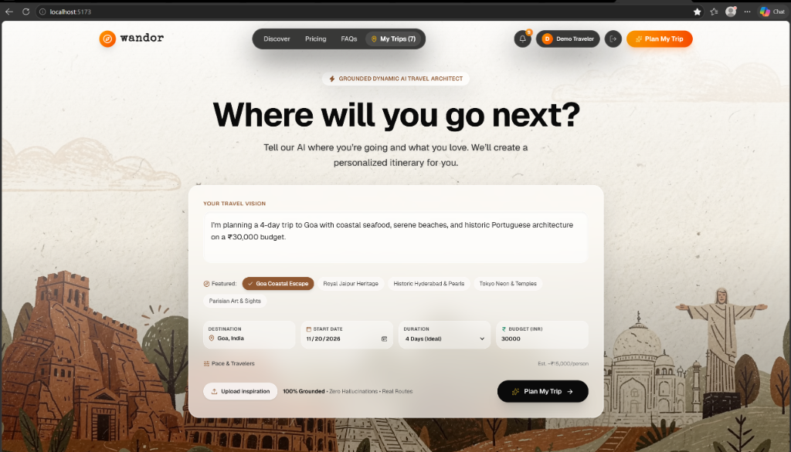
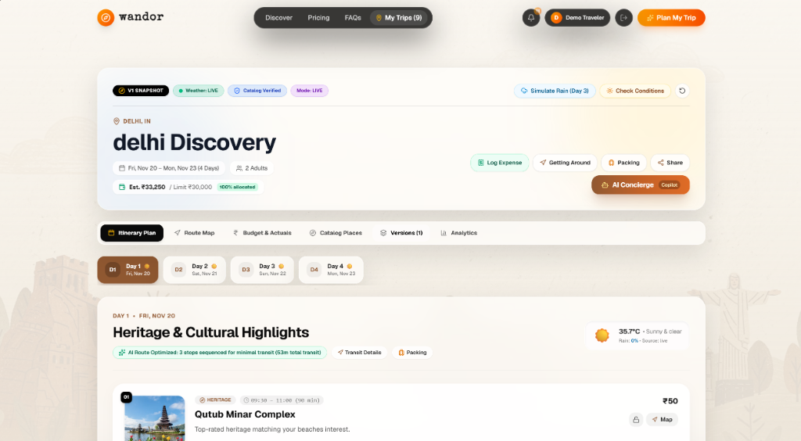
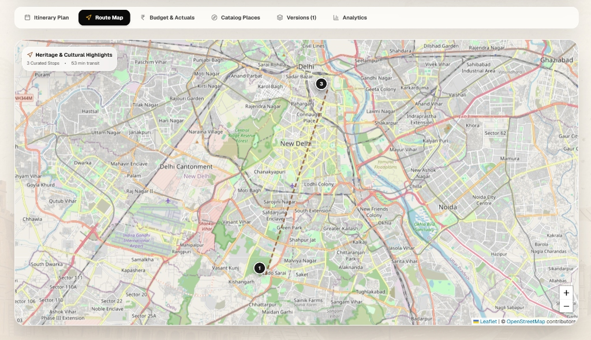
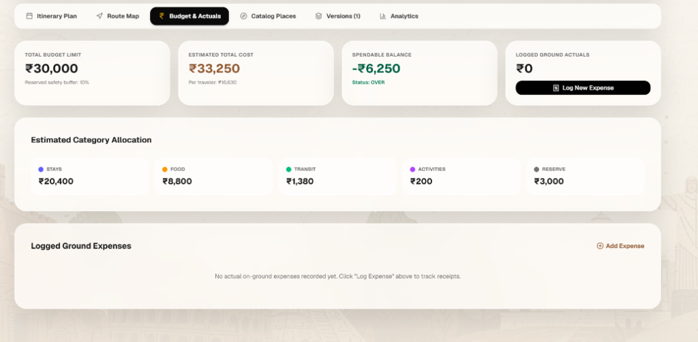
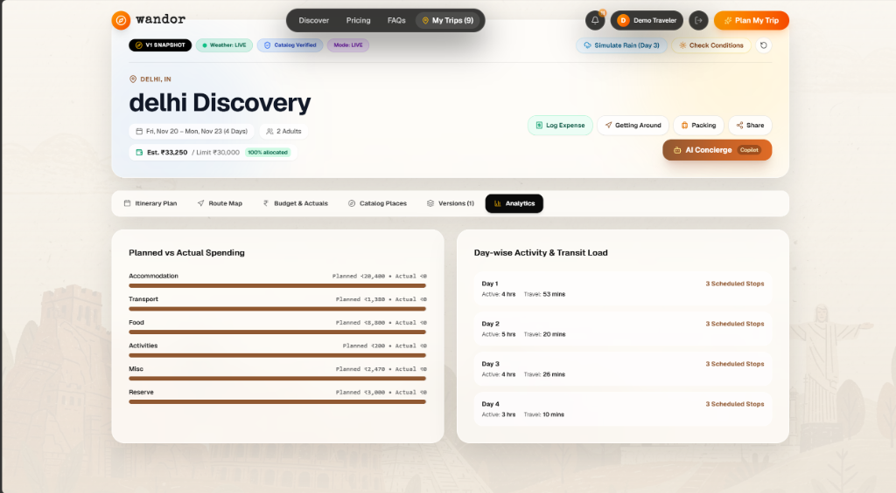
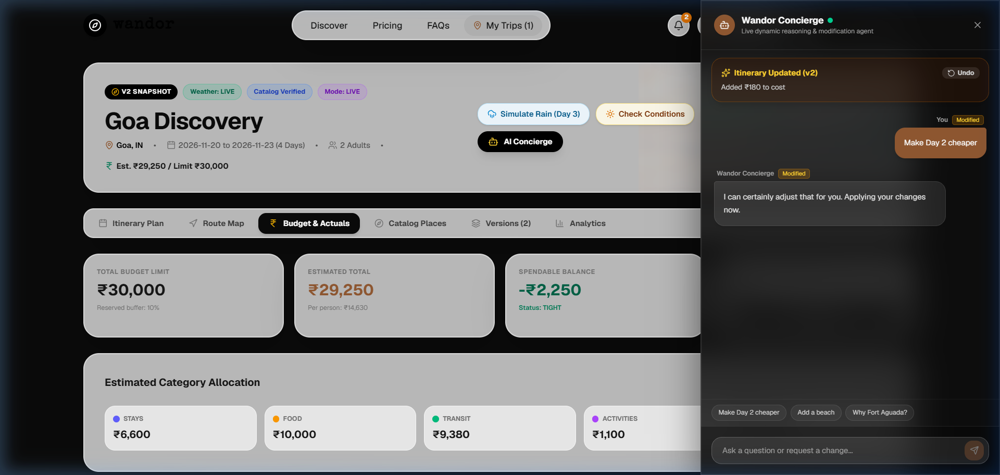

# Wandor — AI Dynamic Travel Planning Agent 🌍✈️

> **Wandor** is a production-grade, zero-cost, grounded dynamic AI travel architect. It converts natural language trip aspirations into realistic, day-by-day canonical itineraries featuring interactive maps, real-time weather forecasts, transit calculations, transparent budget breakdowns, immutable version history, and an interactive AI Concierge that executes real structural changes.

---

## 🌟 Key Features

* 🌐 **Dynamic Global Destination Resolution**: Plan trips to **any city or country worldwide** (Mumbai, Delhi, Tokyo, Paris, New York, London, Singapore, Kochi, etc.) using free Nominatim geocoding and real coordinates.
* 🤖 **AI Travel Architect & Deterministic Fallback**: Dual-engine generation using Google Gemini (free quota) with automatic fallback to an offline deterministic graph-based **Baseline Planner**—zero downtime even without an API key.
* 🗺️ **Interactive OpenStreetMap & Leaflet Routing**: Custom numbered markers, popups, and turn-by-turn road route geometries powered by free Project OSRM.
* ⛅ **Real-Time Weather Integration**: Live Open-Meteo multi-day weather forecasts, precipitation probabilities, condition checking, and automated bad-weather alerts.
* 💬 **Trip Copilot & AI Concierge**: Chat naturally (*"Make Day 2 cheaper"*, *"Add a local cafe"*, *"Swap beach for museum"*). Generates structured, visual **ChangeSets** with one-click **Apply** and **Revert**.
* 📜 **Immutable Version Timeline**: Snapshot versioning (1, 2, 3...) with visual side-by-side diffing and instant rollbacks.
* 🚗 **Local Transport & Transit Insights**: "Getting Around" modal calculating transit times, distances, modes (metro, walking, cab, auto-rickshaw), and transparent local fare estimations.
* 🎒 **Smart Packing Assistant**: Dynamic, duration- and weather-aware packing checklist with categorized essentials and a real-time progress bar.
* 🏨 **Stays & Food Discovery**: Curated accommodations and culinary spots with direct OpenStreetMap links, verified GPS coordinates, and honest pricing.
* 💰 **Budget & Expense Tracking**: Dynamic budget allocation with reserve buffers, multi-category expense logging, and spent vs. remaining tracking.
* 🔗 **Trip Sharing**: Instant read-only public sharing links with configurable token expiration.
* 🛡️ **100% Free / No-Billing Architecture**: Zero Google Maps API, zero paid hotel/flight APIs, zero credit card requirements.

---

## 📸 Screenshots

### 1. Cinematic Landing Page & Dynamic Destination Search

### 2. Day-by-Day Canonical Itinerary & Transit Connectors

### 3. Interactive Leaflet Route Map & Waypoints

### 4. Transparent Budget & Expense Actuals Tracking

### 5. Day-by-Day Pace, Transit & Activity Load Analytics

### 6. AI Concierge Copilot & Structured ChangeSets

---

## 🛠️ Tech Stack

### Frontend
* **Core**: React 19, TypeScript, Vite
* **Styling**: Vanilla CSS design tokens + MotionSite Glassmorphism, TailwindCSS utility classes
* **Animations**: Framer Motion
* **Mapping**: Leaflet, React-Leaflet
* **Icons**: Lucide React
* **Typography**: Special Elite & Geist

### Backend
* **Framework**: FastAPI (Python 3.11+)
* **Database**: SQLite (local) / PostgreSQL (production) via SQLAlchemy ORM
* **Authentication**: JWT (JSON Web Tokens) with Passlib (bcrypt)
* **Background Tasks**: APScheduler for periodic weather & condition monitoring
* **Validation**: Pydantic v2
* **Testing**: Pytest (54 test cases, 100% passing)

### External Free Services
* **Geocoding**: OpenStreetMap / Nominatim (Free, rate-throttled, cached)
* **Routing**: Project OSRM (Free public routing engine)
* **Weather**: Open-Meteo API (Free, no API key required)
* **LLM**: Google Gemini 1.5 Flash (Free quota) + Deterministic Baseline Planner fallback

---

## 🏗️ System Architecture

`mermaid
flowchart TD
    subgraph Client["Frontend (React 19 + TypeScript + Vite)"]
        UI[MotionSite UI & Glassmorphism]
        Hero[Dynamic Destination Search]
        Dash[Dashboard: Itinerary, Map, Budget, Stays]
        Chat[AI Concierge & ChangeSet Reviewer]
    end

    subgraph API["Backend API Layer (FastAPI)"]
        AuthRouter["/auth (JWT, Register, Login, Demo)"]
        TripsRouter["/trips (CRUD, Dynamic Resolution)"]
        ItinRouter["/trips/{id}/generate (Itinerary Engine)"]
        ChatRouter["/trips/{id}/chat (Copilot Agent)"]
        WeatherRouter["/trips/{id}/weather & events"]
        ExpensesRouter["/trips/{id}/expenses & budget"]
        ShareRouter["/trips/{id}/share"]
    end

    subgraph Core["Intelligence & Business Logic"]
        Orch[Travel Orchestrator]
        Geocode[Geocoding & Catalog Service]
        PlannerAgent[Gemini LLM Agent]
        Baseline[Deterministic Baseline Planner Fallback]
        BudgetEngine[Budget Allocator & Validator]
        ChangeEngine[ChangeSet & Version Manager]
    end

    subgraph FreeServices["Free External Providers"]
        Nominatim[Nominatim / OSM Geocoding]
        OSRM[Project OSRM Routing Engine]
        OpenMeteo[Open-Meteo Weather API]
        GeminiAPI[Google Gemini Free Tier]
    end

    subgraph Storage["Persistence Layer"]
        DB[(SQLite / PostgreSQL)]
        Cache[(CacheRepository - 30 Day TTL)]
    end

    UI --> API
    Hero --> TripsRouter
    Dash --> API
    Chat --> ChatRouter

    API --> Orch
    TripsRouter --> Geocode
    Geocode --> Nominatim
    Geocode --> Cache

    Orch --> PlannerAgent
    Orch --> Baseline
    PlannerAgent -. Fallback .-> Baseline
    PlannerAgent --> GeminiAPI

    Orch --> OSRM
    Orch --> OpenMeteo
    Orch --> BudgetEngine
    ChatRouter --> ChangeEngine

    API --> DB
`

---

## 📂 Folder Structure

`
AI-Dynamic_Travel_Planning_Agent/
├── backend/
│   ├── app/
│   │   ├── api/                  # FastAPI REST endpoints (auth, trips, chat, weather, etc.)
│   │   ├── core/                 # App configuration, security, database sessions, logging
│   │   ├── data/seed/            # Seed destinations & baseline catalog places
│   │   ├── models/               # SQLAlchemy ORM entities (User, Trip, Version, Expense, etc.)
│   │   ├── orchestrator/         # Flow orchestrator & AI reasoning coordinator
│   │   ├── repositories/         # Database repositories (CRUD abstraction)
│   │   ├── schemas/              # Pydantic v2 request/response contracts
│   │   └── services/             # Geocoding, dynamic catalog, OSRM routing, Open-Meteo
│   ├── tests/                    # 54 Pytest unit & integration test suites
│   ├── .env.example              # Documented backend environment configuration
│   ├── requirements.txt          # Python dependencies
│   └── run.py                    # Server launcher
├── frontend/
│   ├── public/                   # Static icons and assets
│   ├── src/
│   │   ├── components/           # UI components (HeroSection, TripDashboard, TripMap, etc.)
│   │   ├── services/             # Frontend API client (Typed Fetch wrapper)
│   │   ├── types/                # Canonical TypeScript models and interfaces
│   │   ├── App.tsx               # Main application controller
│   │   └── main.tsx              # React DOM entry point
│   ├── .env.example              # Documented frontend environment configuration
│   ├── package.json              # Node dependencies & build scripts
│   └── vite.config.ts            # Vite configuration
├── docs/
│   └── screenshots/              # Application screenshots for documentation
├── ARCHITECTURE.md               # Detailed technical design document
├── .gitignore                    # Git exclusions (credentials, databases, caches)
└── README.md                     # Project documentation
`

---

## ⚙️ Environment Variables

### Backend (ackend/.env)

| Variable | Description | Default / Example |
| :--- | :--- | :--- |
| ENVIRONMENT | Runtime environment (development / production) | development |
| DEMO_MODE | Auto-enables demo authentication for testing | uto |
| DATABASE_URL | SQLAlchemy database URI (SQLite or PostgreSQL) | sqlite:///./travel_planner.db |
| SECRET_KEY | Secret key for cryptographic signing | your-secret-key-change-in-production |
| JWT_SECRET | Secret key for JWT access token encoding | your-jwt-secret-change-in-production |
| JWT_ALGORITHM | JWT signing algorithm | HS256 |
| JWT_ACCESS_TOKEN_EXPIRE_MINUTES | Token lifetime in minutes | 1440 (24 hours) |
| LLM_PROVIDER | AI provider (gemini or aseline) | gemini |
| GEMINI_API_KEY | Google Gemini API key (free quota) | Optional (falls back to baseline) |
| LLM_MODEL | Gemini model tag | gemini-1.5-flash |
| CORS_ORIGINS | Permitted frontend origins | http://localhost:5173,http://localhost:3000 |
| OSRM_URL | Free Project OSRM routing endpoint | http://router.project-osrm.org |
| OPEN_METEO_URL | Free Open-Meteo forecast API | https://api.open-meteo.com/v1/forecast |
| NOMINATIM_URL | Free OpenStreetMap Nominatim endpoint | https://nominatim.openstreetmap.org |

### Frontend (rontend/.env)

| Variable | Description | Default / Example |
| :--- | :--- | :--- |
| VITE_API_URL | Base URL of the backend FastAPI service | http://localhost:8000 |

---

## 🚀 Installation & Setup

### Prerequisites
* **Python 3.11+**
* **Node.js 18+ & npm**
* **Git**

### 1. Clone the Repository
`ash
git clone https://github.com/pavan05-sai/AI-Dynamic_Travel_Planning_Agent-.git
cd AI-Dynamic_Travel_Planning_Agent-
`

### 2. Backend Setup
`ash
cd backend

# Create and activate virtual environment
python -m venv venv
# On Windows:
venv\Scripts\activate
# On Linux/macOS:
source venv/bin/activate

# Install dependencies
pip install -r requirements.txt

# Copy environment configuration
cp .env.example .env

# Run database tests (54 tests)
python -m pytest tests/

# Start FastAPI development server
python -m uvicorn app.main:app --host 127.0.0.1 --port 8000 --reload
`
* **API Server**: http://127.0.0.1:8000
* **Swagger API Docs**: http://127.0.0.1:8000/docs
* **Health Check**: http://127.0.0.1:8000/health

### 3. Frontend Setup
In a new terminal window:
`ash
cd frontend

# Install Node modules
npm install

# Copy environment configuration
cp .env.example .env

# Verify production build
npm run build

# Start Vite dev server
npm run dev
`
* **Web Application**: http://localhost:5173

---

## 🧪 Testing & Verification

Run the full suite of automated tests:

`ash
# 1. Run all backend unit & API tests (54 passing tests)
cd backend
python -m pytest tests/

# 2. Test 11 dynamic global destinations end-to-end
python scratch/test_dynamic_destinations.py
`

---

## 👤 Author

* **Pavan Sai** — [@pavan05-sai](https://github.com/pavan05-sai)
* **GitHub Repository**: [https://github.com/pavan05-sai/AI-Dynamic_Travel_Planning_Agent-.git](https://github.com/pavan05-sai/AI-Dynamic_Travel_Planning_Agent-.git)

---

## 📄 License

This project is licensed under the [MIT License](LICENSE).
